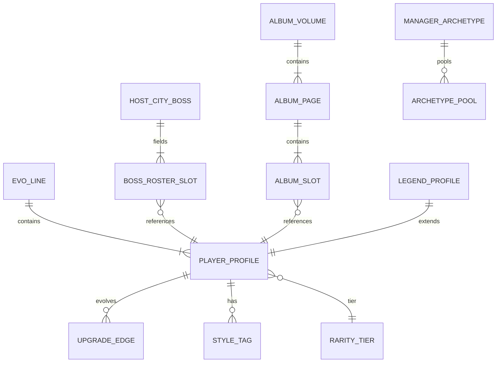

# Spec 003 — Football Content Architecture

**Project:** Pokelike → World Cup Football Reskin  
**Version referenced:** v1.6 engine (per Spec 001)  
**Analysis date:** 2026-06-05  
**Scope:** Design only — no production code modified.  
**Inputs:** [001-codebase-discovery.md](./001-codebase-discovery.md), [002-worldcup-mapping.md](./002-worldcup-mapping.md)

---

## Purpose

This document defines the **complete football content model** for the World Cup reskin: how fictional players, playing styles, rarity, evolution, bosses, tournament flow, Continental Champions Cup, and the World Cup Album map onto the existing Pokelike engine **without engine changes**.

All internal keys (`speciesId`, `evoLineRoot`, `moveTier`, `TYPE_CHART`, `localStorage` shapes) remain valid during transition. Football content is a **parallel catalog layer** keyed by `playerProfileId` (= `speciesId`).

---

## Executive Summary

| Engine concept | Football content model |
|----------------|------------------------|
| `speciesId` | `playerProfileId` — stable catalog key (1–649) |
| Pokémon types | **Playing styles** (18 styles, 1:1 type map) |
| BST bucket | **Rarity tier** (Common → Legendary) |
| Evolution | **Player upgrade** (youth → first team → star) |
| Shiny | **Gold card** variant |
| Gym leaders | **Host City Bosses** (8 federation chiefs) |
| Elite Four | **Knockout Stage** (5 gates) |
| Battle Tower | **Continental Champions Cup** |
| Pokédex | **World Cup Album** (sticker pages) |
| `moveTier` 0–2 | **Skill tier** I–III |
| `statBuffs` | **Legacy training** per player line |

---

## Design Principles

1. **Zero engine changes** — content ships as JSON catalogs consumed by existing loaders (`createInstance`, `EVOLUTIONS`, `GYM_LEADERS`, `endless.js` pools).
2. **ID stability** — `playerProfileId` equals current `speciesId` so saves, dex keys, evolution tables, and BST pools require no migration.
3. **Fictional roster** — all player names, nations, and portraits are original; no licensed real-world players in the default catalog.
4. **Mechanics fidelity** — rarity affects **where** players appear (BST bucket), not separate combat math. Legendaries remain node-gated.
5. **Album-first collection** — the World Cup Album is the primary meta-progression surface; rarity controls sticker foil treatment.

---

## 1. Player Rarity System

### 1.1 Rarity tiers

Rarity is derived from the engine's `GEN1_BST_APPROX` bucket assignment. Each tier controls scouting weight, album presentation, and flavor — not base stat formulas (stats come from the profile catalog).

| Rarity | Engine bucket | BST range (fallback) | Album treatment | Scouting flavor |
|--------|---------------|----------------------|-----------------|-----------------|
| **Common** | `low` | &lt; 280 | Standard sticker | Youth academy, squad filler |
| **Uncommon** | `midLow` | 280–339 | Standard sticker | Solid pro, role player |
| **Rare** | `mid` | 340–399 | Silver foil border | First-team regular |
| **Elite** | `midHigh` | 400–459 | Gold foil border | Star signing |
| **Superstar** | `high` | 460–529 | Holographic foil | World-class talent |
| **Mythic** | `veryHigh` | ≥ 530 | Prismatic foil | Generational prospect |
| **Legendary** | `LEGENDARY_IDS` | N/A (fixed profiles) | Legendary foil + dedicated album page | World Cup Legends |

**Gold card** (shiny) overlays any tier: doubles trait count in Continental Champions Cup and uses a gold portrait frame in the album. Completing the Modern Era album (IDs 1–151) unlocks **Scout Network Upgrade** (shiny charm equivalent, 2% gold-card rate).

### 1.2 Rarity rules (engine-aligned)

| Rule | Source behavior | Football framing |
|------|-----------------|------------------|
| Legendaries excluded from scout pools | `LEGENDARY_IDS` filter in `getCatchChoices` | Legends only via **World Cup Legend** nodes |
| Starters excluded from wild scout | `STARTER_IDS` / `GEN2_STARTER_IDS` | **Marquee signing** archetypes are run-start only |
| Map-gated rolls | `getPokemonLocations` + BST bucket | Higher rarity appears in later **Host City legs** |
| Endless gen gating | `STAGE_MAX_GEN_ID` | Continental Cup edition unlocks deeper catalog slices |

### 1.3 Rarity JSON schema (catalog field)

```json
{
  "playerProfileId": 25,
  "rarity": "uncommon",
  "rarityTier": 2,
  "albumFoil": "standard",
  "scoutWeight": 1.0,
  "isLegendary": false,
  "isStarter": false,
  "isMarquee": false
}
```

**`rarityTier`** (1–7) is display-only sorting. **`scoutWeight`** defaults to 1.0; event nodes may multiply (e.g., 1.5× Elite on map 6+).

---

## 2. Player Evolution System

### 2.1 Upgrade paths

Evolution maps 1:1 to **player upgrade** milestones. The engine's `EVOLUTIONS` and `BRANCHING_EVOLUTIONS` tables are preserved; only display names and portrait assets change.

| Engine field | Football field | Example |
|--------------|----------------|---------|
| `into` | `upgradedProfileId` | 1 → 2 |
| `level` | `formLevelRequired` | 16 |
| `name` | `upgradedDisplayName` | "Marco Silva" → "Marco Silva (Star)" |
| `types` (branching) | `developmentStyles` | Pressing → High Press + Wide Play |

### 2.2 Upgrade categories

| Category | Engine pattern | Football narrative |
|----------|----------------|-------------------|
| **Linear upgrade** | Single `EVOLUTIONS` entry | Youth → First team → Club star |
| **Development path** | `BRANCHING_EVOLUTIONS` | Tactical reposition at milestone (Finisher vs False 9) |
| **Breakthrough injection** | Moon Stone consumable | Instant upgrade regardless of form level |
| **Youth prospect clause** | Eviolite held item | Bonus defense if not fully upgraded |
| **Skill manual** | TM / Move Tutor | Skill tier I → II → III |

### 2.3 Branching example — Profile 133 (Eevee equivalent: "Luca Versatile")

At form level 20, manager chooses **one** development path:

| Path ID | Upgraded ID | Name | Styles | Role flavor |
|---------|-------------|------|--------|-------------|
| `path_press` | 136 | Luca Versatile (Presser) | High Press | Box-to-box engine |
| `path_possession` | 134 | Luca Versatile (Orchestrator) | Possession Build-up | Deep-lying playmaker |
| `path_counter` | 135 | Luca Versatile (Sprinter) | Rapid Counter | Wide outlet winger |
| `path_tactical` | 196 | Luca Versatile (Maestro) | Tactical Control | Advanced playmaker |
| `path_dark_arts` | 197 | Luca Versatile (Enforcer) | Dark Arts | Physical disruptor |
| `path_wide` | 470 | Luca Versatile (Overlapping) | Overlap & Cross | Wing-back convert |
| `path_ice` | 471 | Luca Versatile (Ice Cool) | Ice Press | Clinical finisher |

Engine stores the choice in `speciesId` after upgrade — no new fields required.

### 2.4 Evolution JSON schema

```json
{
  "playerProfileId": 1,
  "evoLineRoot": 1,
  "upgradeChain": [
    { "from": 1, "to": 2, "formLevel": 16, "displayName": "Pedro Mendes (Breakthrough)" },
    { "from": 2, "to": 3, "formLevel": 32, "displayName": "Pedro Mendes (World Class)" }
  ],
  "branchingAt": null
}
```

```json
{
  "playerProfileId": 133,
  "evoLineRoot": 133,
  "branchingAt": 20,
  "developmentPaths": [
    { "to": 136, "formLevel": 20, "name": "Luca Versatile (Presser)", "styles": ["High Press"] },
    { "to": 134, "formLevel": 20, "name": "Luca Versatile (Orchestrator)", "styles": ["Possession Build-up"] }
  ]
}
```

### 2.5 Progression example — Striker line (IDs 4→5→6)

```
Form Lv. 1  — Sign "Diego Núñez (Prospect)"     [Common, High Press]
Form Lv. 16 — Auto-upgrade → "Diego Núñez (First Team)"  [Uncommon]
Form Lv. 36 — Auto-upgrade → "Diego Núñez (Icon)"        [Elite]
Optional    — Skill manual at Specialist Coach → Skill II
Optional    — Breakthrough injection at Lv. 12 → skip to ID 5 early
```

---

## 3. Playing Styles

### 3.1 Style chart (18 styles)

Playing styles replace Pokémon types. The engine `TYPE_CHART` matrix is **unchanged**; only labels, icons, and move flavor text are reskinned.

| Style ID | Engine type | Color | Combat identity | Signature skill flavor |
|----------|-------------|-------|-----------------|------------------------|
| `balanced` | Normal | #A8A878 | All-round | Link-up play |
| `physical_battle` | Fighting | #C03028 | Duel dominance | Shoulder challenge |
| `wide_play` | Flying | #A890F0 | Evasive runs | Overlapping cross |
| `dark_arts` | Poison | #A040A0 | Attrition | Professional foul |
| `aerial_threat` | Ground | #E0C068 | Aerial duels | Long ball control |
| `compact_block` | Rock | #B8A038 | Low block | Last-ditch tackle |
| `high_intensity` | Bug | #A8B820 | Swarm pressing | Harrying press |
| `clinical_finishing` | Ghost | #705898 | Opportunistic | Poacher's finish |
| `iron_defense` | Steel | #B8B8D0 | Structural defense | Organized line |
| `high_press` | Fire | #F08030 | Aggressive press | Gegenpress burst |
| `possession_buildup` | Water | #6890F0 | Circulation | Tiki-taka probe |
| `wing_play` | Grass | #78C850 | Wide creation | Cut inside shot |
| `rapid_counter` | Electric | #F8D030 | Transition speed | Lightning counter |
| `ice_press` | Ice | #98D8D8 | Controlled tempo | Ice-cold finish |
| `tactical_control` | Psychic | #F85888 | Game reading | Through-ball vision |
| `overlap_cross` | Bug* | — | (uses Bug pool) | — |
| `power_strike` | Dragon | #7038F8 | Dominant duel | Power header |
| `street_smarts` | Dark | #705848 | Cunning play | Nutmeg & probe |
| `set_piece_master` | Fairy | #EE99AC | Dead-ball threat | Curling free kick |

\*Dual-type players carry **primary + secondary** style; trait counting uses both.

### 3.2 Style matchup (unchanged math)

Example: **High Press** (Fire) vs **Possession Build-up** (Water):

- High Press attacks Possession at **2×** effectiveness (pressing disrupts build-up).
- Possession resists High Press at **0.5×** when defending.

Full 18×18 matrix = existing `TYPE_CHART`.

### 3.3 Team tactical traits (Battle Tower / Continental Cup)

Style count on squad determines trait tier (2 / 4 / 6 copies; gold card = 2× count):

| Style | Tier 1 (2 copies) | Tier 3 (6 copies) |
|-------|-------------------|-------------------|
| High Press | +1 Power & Technique at duel start | +3 Power & Technique at duel start |
| Possession Build-up | 33% chance: drain opponent Pace on hit | 100% chance: -3 Pace/Technique on hit |
| Clinical Finishing | Execute below 15% Stamina | Execute below 50% Stamina |
| Compact Block | -15% incoming duel damage | -45% incoming duel damage |

Descriptions map 1:1 from `TRAIT_DESCRIPTIONS` in `endless.js`.

### 3.4 Style JSON (profile fragment)

```json
{
  "playerProfileId": 6,
  "styles": ["High Press", "Wide Play"],
  "primaryStyle": "High Press",
  "traitTags": ["press", "wide"],
  "signatureSkills": {
    "physical": ["Shoulder Challenge", "Power Header", "Iconic Strike"],
    "technical": ["Pressing Burst", "Long-Range Shot", "Match-Winning Rocket"]
  }
}
```

---

## 4. Legendary Players

### 4.1 World Cup Legends catalog

Legendaries use fixed `playerProfileId` entries from `LEGENDARY_IDS`. They appear **only** on `legendary` nodes (and 1/6 catch upgrades in Continental Cup Region 3).

| Era | ID range | Count | Theme |
|-----|----------|-------|-------|
| Modern Era | 144–151 | 8 | Founding World Cup icons |
| Classic Era | 243–251 | 9 | Golden age heroes |
| Expansion I | 377–386 | 10 | Continental kings |
| Expansion II | 480–493 | 14 | New millennium greats |
| Expansion III | 494–649 subset | 14 | Current-era myths |

### 4.2 Legendary profile schema

```json
{
  "playerProfileId": 150,
  "name": "The Titan",
  "nickname": "Experiment X",
  "nation": "Neutral",
  "position": "ST",
  "styles": ["Tactical Control"],
  "rarity": "legendary",
  "albumPage": "legends_vol_1",
  "albumSlot": 6,
  "baseStats": { "hp": 106, "atk": 110, "def": 90, "speed": 130, "special": 154, "spdef": 90 },
  "legendTag": "WORLD_CUP_LEGEND",
  "encounterNode": "legendary",
  "flavorText": "A prototype footballer from a classified training program. Scouts debate whether he is human."
}
```

### 4.3 Modern Era legends (IDs 144–151) — sample names

| ID | Name | Nation | Position | Style(s) | Album title |
|----|------|--------|----------|----------|-------------|
| 144 | Viktor "Blizzard" Kovač | Alpine | GK | Ice Press | The Wall |
| 145 | Stefan "Voltage" Richter | Alpine | ST | Rapid Counter | The Bolt |
| 146 | Marco "Thermal" Esposito | Mediterranean | LW | High Press | The Flame |
| 150 | Subject Mew | Neutral | CAM | Tactical Control | The Unknown |
| 151 | Subject Mewtwo | Neutral | ST | Tactical Control | The Ultimate |

### 4.4 Legend encounter flow

```
Map 6+ node roll → legendary node (weight 2)
  → Guaranteed 1-of-1 signing offer (no BST roll)
  → Album: stamp Legendary foil + mark caught { "150": 1 }
  → If squad full → Squad registration swap screen
```

---

## 5. Boss Progression

### 5.1 Host City Bosses (8 stamps)

Each boss maps to `GYM_LEADERS[i]` / `JOHTO_GYM_LEADERS[i]` by `mapIndex`. Reward = **City Stamp** (`state.badges` counter).

#### Modern Era — Host City table

| Map | Host City Leg | Boss (Manager) | Federation style | Stamp name | Team size | Peak form |
|-----|---------------|----------------|------------------|------------|-----------|-----------|
| 0 | São Paulo Leg | **Coach Rocha** | Compact Block | Granite Stamp | 2 | Lv. 14 |
| 1 | Berlin Leg | **Coach Fischer** | Possession Build-up | River Stamp | 2 | Lv. 20 |
| 2 | Tokyo Leg | **Coach Tanaka** | Rapid Counter | Thunder Stamp | 3 | Lv. 25 |
| 3 | Madrid Leg | **Coach Vega** | Wing Play | Garden Stamp | 3 | Lv. 32 |
| 4 | Milan Leg | **Coach Russo** | Dark Arts | Soul Stamp | 4 | Lv. 44 |
| 5 | Amsterdam Leg | **Coach de Vries** | Tactical Control | Mind Stamp | 4 | Lv. 44 |
| 6 | Mexico City Leg | **Coach Herrera** | High Press | Volcano Stamp | 4 | Lv. 53 |
| 7 | London Leg | **Coach Stone** | Aerial Threat | Earth Stamp | 5 | Lv. 60 |

#### Classic Era — parallel bosses

Same structure via `JOHTO_GYM_LEADERS`: Falkner → Whitney → Morty → … → Clair, with Classic roster pools.

### 5.2 Boss JSON schema

```json
{
  "bossId": "host_city_0",
  "mapIndex": 0,
  "name": "Coach Rocha",
  "title": "São Paulo Federation Chief",
  "primaryStyle": "Compact Block",
  "stampReward": {
    "id": "stamp_granite",
    "displayName": "Granite Stamp",
    "albumPage": "host_cities_modern",
    "slot": 0
  },
  "moveTier": 0,
  "team": [
    {
      "playerProfileId": 74,
      "displayName": "Wall Defender (Prospect)",
      "formLevel": 12,
      "styles": ["Compact Block", "Aerial Threat"],
      "heldItemId": null
    },
    {
      "playerProfileId": 95,
      "displayName": "The Colossus",
      "formLevel": 14,
      "styles": ["Compact Block", "Aerial Threat"],
      "heldItemId": "rocky_helmet"
    }
  ]
}
```

### 5.3 Knockout Stage bosses (Elite Four equivalent)

| Gate | Engine | Football name | Manager archetype |
|------|--------|---------------|-------------------|
| 1 | Lorelei | **Round of 16** — Coach Lindqvist | Ice + Possession hybrid |
| 2 | Bruno | **Quarter-final** — Coach Martins | Physical Battle |
| 3 | Agatha | **Semi-final** — Coach Ashford | Clinical Finishing |
| 4 | Lance | **Final** — Coach Drago | Power Strike |
| 5 | Gary / Lance (Champion) | **Trophy lift** — Coach Sterling | Mixed styles |

Requires **8 City Stamps** to unlock Knockout Stage (`state.badges >= 8`).

---

## 6. Tournament Progression

### 6.1 World Cup campaign arc

```
Marquee signing → Host City Leg 0 → … → Host City Leg 7 (8 stamps)
  → Knockout draw ceremony → Matchday squad selection
  → R16 → QF → SF → Final → Trophy lift → Trophy Room entry
  → Unlocks Continental Champions Cup
```

### 6.2 Host City leg structure (per map)

Engine: `generateMap(mapIndex)` — 8 layers DAG unchanged.

| Layer | Football event | Node types (typical) |
|-------|----------------|----------------------|
| Start | Arrival in host city | `start` |
| L1–L2 | Training week | `battle`, `catch`, `trainer` |
| L3–L5 | Match prep | `item`, `move_tutor`, `trade`, `question` |
| L6 | Recovery | forced `pokecenter` on last content layer |
| Boss | Host City Boss | `boss` → City Stamp |

### 6.3 Form level curve (match experience)

| Event | Engine gain | Display |
|-------|-------------|---------|
| Trainer / boss win (Normal) | +2 levels | +2 Form Lv. |
| Friendly match win | +1 | +1 Form Lv. |
| Injury List mode win | +1 | +1 Form Lv. |
| Lucky Egg equivalent | +50% | Fitness boost consumable |

### 6.4 Tournament state (run snapshot)

Uses existing `state` object — football labels only:

```json
{
  "mode": "world_cup_campaign",
  "era": "modern",
  "cityStamps": 3,
  "badges": 3,
  "mapIndex": 3,
  "hostCity": "Madrid Leg",
  "squad": ["/* player instances */"],
  "maxSquadSize": 6,
  "injuryListMode": false
}
```

### 6.5 Progression walkthrough (abbreviated)

| Step | Player action | Engine handler | Result |
|------|---------------|----------------|--------|
| 1 | Pick Marquee signing (ID 4) | `starter-screen` | Squad: Diego Núñez Lv. 5 |
| 2 | Scout node — pick ID 25 | `doCatchNode` | Album `{25:1}`, squad size 2 |
| 3 | Friendly match node | `doBattleNode` | Diego → Lv. 6 |
| 4 | Medical tent | `doPokeCenterNode` | Full stamina restore |
| 5 | Boss — Coach Rocha | `doBossNode` | Stamp 1, Diego → Lv. 18 |
| 6 | … repeat maps 1–7 … | — | 8 stamps |
| 7 | Knockout R16 | Elite battle 0 | Squad reorder + items |
| 8 | Trophy lift | Champion win | Trophy Room + CCC unlock |

---

## 7. Continental Champions Cup (Battle Tower Replacement)

### 7.1 Structure (unchanged topology)

| Dimension | Engine | Football label |
|-----------|--------|----------------|
| 5 Stages | `stageNumber` 1–5 | Cup Edition I–V |
| 3 Regions / stage | `regionNumber` 1–3 | Confederation bracket |
| 3 Maps / region | `mapIndexInRegion` 0–2 | Group mini-leg → Confederation final |
| Traits | `buildTraitsConfig` | Tactics board |
| Stat rewards | `stat-buff-screen` | Legacy training investment |

### 7.2 Confederation mapping

| Region | Football confederation | Forced marquee (REGION_STARTERS) | Boss flavor |
|--------|------------------------|----------------------------------|-------------|
| R1 | **UEFA** | European youth ID | Technical masters |
| R2 | **CONMEBOL** | South American youth ID | Flair + press |
| R3 | **CAF** | African youth ID | Physical + counter |

Stages 1–5 finals use `FIXED_STAGE_REGIONS` hand-crafted **Historical XI** squads. Stage 6+ uses `elite_alltype` archetype.

### 7.3 Manager archetypes (`ENDLESS_ARCHETYPES`)

| Archetype ID | Pokémon name | Football manager |
|--------------|--------------|------------------|
| `fire_ace` | Fire Ace | **Pressing Zealot** |
| `water_lord` | Water Lord | **Possession Purist** |
| `rock_titan` | Rock Titan | **Low Block Architect** |
| `psychic_sage` | Psychic Sage | **Tactical Mastermind** |
| `stage1_boss` | Ash Ketchum | **Wonderkid Manager** |
| `stage5_boss` | N | **Iconoclast Coach** |

### 7.4 Unlock & legacy training

| Gate | Condition | Reward |
|------|-----------|--------|
| CCC access | `getHallOfFame().length > 0` | Trophy Room has ≥1 World Cup win |
| Stage N+1 | Clear stage N | Higher level ceiling + gen pool |
| Stage complete | Region 3 boss defeated | Legacy training points (6 stats × 10 max per evo line) |

### 7.5 CCC progression example

```
Trophy Room entry (1st World Cup win)
  → Continental Champions Cup menu
  → Edition I, UEFA bracket, forced signing ID 152 (Classic) or 387 (Expansion)
  → Map 0: Coach Erika equivalent — trait panel shows 2× High Press active
  → Map 2: Confederation final vs Historical XI
  → Stage complete → Invest +3 Power on evo line root 4 (Diego Núñez line)
```

---

## 8. Collection Album Structure

### 8.1 Storage mapping (no schema change)

| Football system | Engine key | Shape |
|-----------------|------------|-------|
| World Cup Album | `poke_dex` / future `wc_album` | `{ "<playerProfileId>": 0 \| 1 }` |
| Gold sticker album | `poke_shiny_dex` | `{ "<playerProfileId>": 1 }` |
| Trophy Room | `poke_hall_of_fame` | Run summaries |
| Legacy training | `poke_stat_buffs` | `{ "<evoLineRoot>": { hp, atk, … } }` |
| Stamp book | `state.badges` + achievement | 0–8 counter |

**Optional alias migration:** `wc_album` merges with `poke_dex` on read (union max).

### 8.2 Album volume layout

| Volume | ID range | Pages | Unlock hint |
|--------|----------|-------|-------------|
| **Vol. 1 — Modern Era** | 1–151 | 16 pages × ~10 slots | Default campaign |
| **Vol. 2 — Classic Era** | 152–251 | 16 pages | Era toggle |
| **Legends Collection** | All `LEGENDARY_IDS` | 1 slot per legend | Legendary nodes |
| **Gold Edition** | Any caught gold | Overlay on Vol. 1–2 | Scout network upgrade |

### 8.3 Page structure

```json
{
  "albumVolumeId": "vol_modern_era",
  "pages": [
    {
      "pageId": "marquee_starters",
      "title": "Marquee Signings",
      "slots": [
        { "playerProfileId": 1, "label": "Wing Play Prospect", "rarity": "common" },
        { "playerProfileId": 4, "label": "High Press Prospect", "rarity": "common" },
        { "playerProfileId": 7, "label": "Compact Block Prospect", "rarity": "common" }
      ]
    },
    {
      "pageId": "host_city_sao_paulo",
      "title": "São Paulo Leg",
      "slots": [
        { "playerProfileId": 74, "label": "Wall Defender" },
        { "playerProfileId": 95, "label": "The Colossus" }
      ],
      "stampId": "stamp_granite"
    }
  ]
}
```

### 8.4 Slot states

| Value | Album UI | Meaning |
|-------|----------|---------|
| `0` | Silhouette sticker | Seen in scout report, not signed |
| `1` | Full color sticker | Signed at least once |
| `gold: 1` | Gold foil overlay | Gold card variant caught |

### 8.5 Completion rewards

| Milestone | Engine trigger | Football reward |
|-----------|----------------|-----------------|
| Vol. 1 complete (151) | `isGenDexComplete(1,151)` | Scout Network Upgrade (2% gold card) |
| All legends Modern Era | All legend IDs 144–151 caught | Legends foil border on Trophy Room |
| Full gold Vol. 1 | All 151 in shiny dex | "Golden Generation" achievement |

---

## 9. Database Schema

The game has no SQL database. This schema defines the **content catalog** (JSON files) and **persistence shapes** (localStorage / cloud).

### 9.1 Content catalog ERD



### 9.2 `player_profiles` (replaces `pokedex.json` entries)

| Column | Type | Notes |
|--------|------|-------|
| `player_profile_id` | INT PK | = `speciesId` |
| `display_name` | VARCHAR | Fictional name |
| `nation_code` | CHAR(3) | Cosmetic (ISO-like, fictional ok) |
| `position` | ENUM | GK, CB, FB, DM, CM, AM, W, ST |
| `primary_style` | VARCHAR | Maps to type 1 |
| `secondary_style` | VARCHAR NULL | Maps to type 2 |
| `rarity` | ENUM | common…legendary |
| `evo_line_root` | INT FK | First form in chain |
| `base_hp` | INT | = `baseStats.hp` |
| `base_pwr` | INT | = `atk` |
| `base_def` | INT | = `def` |
| `base_tec` | INT | = `special` |
| `base_vis` | INT | = `spdef` |
| `base_pac` | INT | = `speed` |
| `portrait_url` | VARCHAR | CDN path |
| `flavor_text` | TEXT | Album / scout flavor |
| `is_legendary` | BOOL | |
| `is_starter` | BOOL | Marquee signing |
| `album_volume` | VARCHAR | |
| `album_page` | VARCHAR | |
| `album_slot` | INT | |

### 9.3 `player_instances` (runtime — existing `createInstance`)

| Column | Type | Notes |
|--------|------|-------|
| `player_profile_id` | INT | |
| `nickname` | VARCHAR NULL | |
| `form_level` | INT | = `level` |
| `current_stamina` | INT | = `currentHp` |
| `max_stamina` | INT | = `maxHp` |
| `is_gold_card` | BOOL | = `isShiny` |
| `skill_tier` | 0–2 | = `moveTier` |
| `held_item_id` | VARCHAR NULL | |
| `legacy_buffs` | JSON | = `statBuffs` |

### 9.4 `upgrade_edges` (replaces `EVOLUTIONS`)

| Column | Type | Notes |
|--------|------|-------|
| `from_profile_id` | INT PK,FK | |
| `to_profile_id` | INT FK | |
| `form_level` | INT | Trigger level |
| `branch_group` | VARCHAR NULL | e.g. `luca_versatile` |
| `display_name` | VARCHAR | Post-upgrade name |

### 9.5 `host_city_bosses`

| Column | Type | Notes |
|--------|------|-------|
| `map_index` | INT PK | 0–7 |
| `era` | ENUM | modern, classic |
| `host_city_name` | VARCHAR | |
| `boss_name` | VARCHAR | |
| `primary_style` | VARCHAR | |
| `stamp_id` | VARCHAR | |
| `roster_json` | JSON | Team array |

### 9.6 `album_entries` (derived view)

| Column | Type | Notes |
|--------|------|-------|
| `player_profile_id` | INT PK | |
| `seen` | BOOL | dex value ≥ 0 |
| `signed` | BOOL | dex value = 1 |
| `gold_signed` | BOOL | shiny dex |

---

## 10. JSON Examples

### 10.1 Full player profile

```json
{
  "playerProfileId": 6,
  "displayName": "Diego Núñez",
  "stageName": "El Fuego",
  "nation": "ARG",
  "position": "ST",
  "styles": ["High Press", "Wide Play"],
  "rarity": "elite",
  "evoLineRoot": 4,
  "baseStats": {
    "hp": 78,
    "atk": 84,
    "def": 78,
    "speed": 100,
    "special": 109,
    "spdef": 85
  },
  "portrait": "/assets/players/006.png",
  "goldPortrait": "/assets/players/006_gold.png",
  "flavorText": "A relentless presser who converts chaos into goals. Managers love his motor; defenders hate it.",
  "album": {
    "volume": "vol_modern_era",
    "page": "elite_strikers",
    "slot": 6
  },
  "upgradeChain": [
    { "from": 4, "at": 16, "name": "Diego Núñez (First Team)" },
    { "from": 5, "at": 36, "name": "Diego Núñez (Icon)" }
  ]
}
```

### 10.2 Squad instance (in-run)

```json
{
  "playerProfileId": 6,
  "displayName": "Diego Núñez (Icon)",
  "nickname": null,
  "formLevel": 42,
  "currentStamina": 187,
  "maxStamina": 210,
  "isGoldCard": false,
  "styles": ["High Press", "Wide Play"],
  "baseStats": { "hp": 78, "atk": 84, "def": 78, "speed": 100, "special": 109, "spdef": 85 },
  "skillTier": 2,
  "heldItem": { "id": "charcoal", "name": "Pressing Kit", "icon": "🔥" },
  "legacyBuffs": { "hp": 0, "atk": 3, "def": 0, "speed": 0, "special": 1, "spdef": 0 }
}
```

### 10.3 Host City Leg content pack

```json
{
  "mapIndex": 2,
  "hostCity": "Tokyo Leg",
  "era": "modern",
  "mapTheme": "neon_night_fixture",
  "levelBand": { "min": 18, "max": 27 },
  "boss": {
    "bossId": "host_city_2",
    "name": "Coach Tanaka",
    "stamp": "Thunder Stamp",
    "primaryStyle": "Rapid Counter"
  },
  "scoutPoolBoost": {
    "rapid_counter": 1.25,
    "high_press": 1.1
  },
  "nodeWeightsOverride": null
}
```

### 10.4 Continental Champions Cup stage definition

```json
{
  "stageNumber": 1,
  "editionName": "Continental Champions Cup I",
  "maxGenId": 151,
  "regions": [
    {
      "regionNumber": 1,
      "confederation": "UEFA",
      "forcedMarqueeId": 152,
      "maps": [
        { "mapIndexInRegion": 0, "boss": "Coach Erika", "levelRange": [1, 7] },
        { "mapIndexInRegion": 1, "boss": "Coach Misty", "levelRange": [12, 18] },
        { "mapIndexInRegion": 2, "boss": "Wonderkid Manager", "levelRange": [18, 24], "isConfederationFinal": true }
      ]
    }
  ],
  "stageBossArchetype": "stage1_boss",
  "legacyTrainingPoints": 3
}
```

### 10.5 Album save blob

```json
{
  "wc_album": {
    "1": 1,
    "4": 1,
    "7": 1,
    "25": 1,
    "74": 0,
    "150": 1
  },
  "wc_gold_album": {
    "25": 1
  },
  "wc_stamps": 8,
  "wc_trophy_room": [
    {
      "runId": "a1b2c3",
      "wonAt": "2026-06-01",
      "era": "modern",
      "marqueeId": 4,
      "squadSnapshot": [4, 25, 65, 6, 112, 131],
      "injuryListMode": false
    }
  ]
}
```

---

## 11. Sample Content — First 50 Players

Fictional roster for **Modern Era Vol. 1, Page 1–5**. Internal IDs 1–50 preserve engine evolution chains and BST assignments.

### 11.1 Summary table

| ID | Name | Nation | Pos | Style(s) | Rarity | Evo root | Page |
|----|------|--------|-----|----------|--------|----------|------|
| 1 | Pedro Mendes | POR | CM | Wing Play | Common | 1 | Youth midfield |
| 2 | Pedro Mendes (Breakthrough) | POR | CM | Wing Play | Uncommon | 1 | Youth midfield |
| 3 | Pedro Mendes (World Class) | POR | CM | Wing Play | Elite | 1 | Youth midfield |
| 4 | Diego Núñez | ARG | ST | High Press | Common | 4 | Marquee strikers |
| 5 | Diego Núñez (First Team) | ARG | ST | High Press | Uncommon | 4 | Marquee strikers |
| 6 | Diego Núñez (Icon) | ARG | ST | High Press / Wide Play | Elite | 4 | Marquee strikers |
| 7 | Jonas Klar | GER | CB | Compact Block | Common | 7 | Marquee defense |
| 8 | Jonas Klar (Starter) | GER | CB | Compact Block | Uncommon | 7 | Marquee defense |
| 9 | Jonas Klar (Captain) | GER | CB | Compact Block / Aerial | Elite | 7 | Marquee defense |
| 10 | Mateo Ríos | CHI | W | High Intensity | Common | 10 | Academy pace |
| 11 | Mateo Ríos (Reserves) | CHI | W | High Intensity | Common | 10 | Academy pace |
| 12 | Mateo Ríos (Senior) | CHI | W | High Intensity / Wide Play | Rare | 10 | Academy pace |
| 13 | Kenji Sato | JPN | W | High Intensity | Common | 13 | Academy pace |
| 14 | Kenji Sato (Reserves) | JPN | W | High Intensity | Common | 13 | Academy pace |
| 15 | Kenji Sato (Senior) | JPN | W | High Intensity / Dark Arts | Rare | 13 | Academy pace |
| 16 | Luca Ferri | ITA | W | Balanced / Wide Play | Common | 16 | Wide threats |
| 17 | Luca Ferri (Breakthrough) | ITA | W | Balanced / Wide Play | Uncommon | 16 | Wide threats |
| 18 | Luca Ferri (Ace) | ITA | W | Balanced / Wide Play | Elite | 16 | Wide threats |
| 19 | Rico Alvarez | MEX | ST | Balanced | Common | 19 | Squad depth |
| 20 | Rico Alvarez (Veteran) | MEX | ST | Balanced | Uncommon | 19 | Squad depth |
| 21 | Sam Okonkwo | NGA | W | Wide Play | Common | 21 | Wide threats |
| 22 | Sam Okonkwo (Starter) | NGA | W | Wide Play | Rare | 21 | Wide threats |
| 23 | Viktor Lang | AUT | DM | Dark Arts | Common | 23 | Dark arts |
| 24 | Viktor Lang (Enforcer) | AUT | DM | Dark Arts | Rare | 23 | Dark arts |
| 25 | Elias "Spark" Brandt | GER | AM | Rapid Counter | Uncommon | 25 | Fan favorites |
| 26 | Elias Brandt (Maestro) | GER | AM | Rapid Counter | Rare | 25 | Fan favorites |
| 27 | Omar Haddad | MAR | FB | Aerial Threat | Common | 27 | Defensive wide |
| 28 | Omar Haddad (Starter) | MAR | FB | Aerial Threat | Uncommon | 27 | Defensive wide |
| 29 | Nina Costa | BRA | DM | Dark Arts | Common | 29 | Midfield anchors |
| 30 | Nina Costa (Breakthrough) | BRA | DM | Dark Arts | Uncommon | 29 | Midfield anchors |
| 31 | Nina Costa (Captain) | BRA | DM | Dark Arts / Aerial | Elite | 29 | Midfield anchors |
| 32 | Theo Martin | FRA | DM | Dark Arts | Common | 32 | Midfield anchors |
| 33 | Theo Martin (Breakthrough) | FRA | DM | Dark Arts | Uncommon | 32 | Midfield anchors |
| 34 | Theo Martin (General) | FRA | DM | Dark Arts / Aerial | Elite | 32 | Midfield anchors |
| 35 | Amélie Dubois | FRA | CAM | Balanced | Uncommon | 35 | Creative minds |
| 36 | Amélie Dubois (Star) | FRA | CAM | Balanced | Rare | 35 | Creative minds |
| 37 | Yuki Tanaka | JPN | W | High Press | Uncommon | 37 | Pressing wingers |
| 38 | Yuki Tanaka (Ace) | JPN | W | High Press | Elite | 37 | Pressing wingers |
| 39 | Bruno Silva | BRA | CAM | Balanced | Uncommon | 39 | Creative minds |
| 40 | Bruno Silva (Showman) | BRA | CAM | Balanced | Rare | 39 | Creative minds |
| 41 | Nico Berg | NOR | W | Wide Play / Dark Arts | Common | 41 | Night fixtures |
| 42 | Nico Berg (Starter) | NOR | W | Wide Play / Dark Arts | Rare | 41 | Night fixtures |
| 43 | Hugo Dias | POR | CM | Wing Play | Common | 43 | Wing play mids |
| 44 | Hugo Dias (Breakthrough) | POR | CM | Wing Play | Uncommon | 43 | Wing play mids |
| 45 | Hugo Dias (Star) | POR | CM | Wing Play / Dark Arts | Elite | 43 | Wing play mids |
| 46 | André Souza | BRA | DM | Wing Play | Common | 46 | Squad depth |
| 47 | André Souza (Anchor) | BRA | DM | Wing Play | Rare | 46 | Squad depth |
| 48 | Felix Moore | ENG | CB | Tactical Control | Common | 48 | Reading the game |
| 49 | Felix Moore (Starter) | ENG | CB | Tactical Control / Wide Play | Rare | 48 | Reading the game |
| 50 | Dante Rojas | CHI | DM | Aerial Threat | Common | 50 | Defensive mid |

### 11.2 Detailed profiles (IDs 1–10)

```json
[
  {
    "playerProfileId": 1,
    "displayName": "Pedro Mendes",
    "nation": "POR",
    "position": "CM",
    "styles": ["Wing Play"],
    "rarity": "common",
    "evoLineRoot": 1,
    "baseStats": { "hp": 45, "atk": 49, "def": 49, "speed": 45, "special": 65, "spdef": 65 },
    "flavorText": "Youth tournament MVP. Keeps the ball moving but lacks top-tier physicality.",
    "upgradeAt": 16,
    "upgradesTo": 2
  },
  {
    "playerProfileId": 2,
    "displayName": "Pedro Mendes (Breakthrough)",
    "nation": "POR",
    "position": "CM",
    "styles": ["Wing Play"],
    "rarity": "uncommon",
    "evoLineRoot": 1,
    "baseStats": { "hp": 60, "atk": 62, "def": 63, "speed": 60, "special": 80, "spdef": 80 },
    "upgradeAt": 32,
    "upgradesTo": 3
  },
  {
    "playerProfileId": 3,
    "displayName": "Pedro Mendes (World Class)",
    "nation": "POR",
    "position": "CM",
    "styles": ["Wing Play"],
    "rarity": "elite",
    "evoLineRoot": 1,
    "baseStats": { "hp": 80, "atk": 82, "def": 83, "speed": 80, "special": 100, "spdef": 100 }
  },
  {
    "playerProfileId": 4,
    "displayName": "Diego Núñez",
    "nation": "ARG",
    "position": "ST",
    "styles": ["High Press"],
    "rarity": "common",
    "evoLineRoot": 4,
    "isMarquee": true,
    "baseStats": { "hp": 39, "atk": 52, "def": 43, "speed": 65, "special": 60, "spdef": 50 },
    "flavorText": "Marquee signing option. Relentless off-ball movement; raw finishing.",
    "upgradeAt": 16,
    "upgradesTo": 5
  },
  {
    "playerProfileId": 5,
    "displayName": "Diego Núñez (First Team)",
    "nation": "ARG",
    "position": "ST",
    "styles": ["High Press"],
    "rarity": "uncommon",
    "evoLineRoot": 4,
    "baseStats": { "hp": 58, "atk": 64, "def": 58, "speed": 80, "special": 80, "spdef": 65 },
    "upgradeAt": 36,
    "upgradesTo": 6
  },
  {
    "playerProfileId": 6,
    "displayName": "Diego Núñez (Icon)",
    "nation": "ARG",
    "position": "ST",
    "styles": ["High Press", "Wide Play"],
    "rarity": "elite",
    "evoLineRoot": 4,
    "baseStats": { "hp": 78, "atk": 84, "def": 78, "speed": 100, "special": 109, "spdef": 85 }
  },
  {
    "playerProfileId": 7,
    "displayName": "Jonas Klar",
    "nation": "GER",
    "position": "CB",
    "styles": ["Compact Block"],
    "rarity": "common",
    "evoLineRoot": 7,
    "isMarquee": true,
    "baseStats": { "hp": 44, "atk": 48, "def": 65, "speed": 43, "special": 50, "spdef": 64 },
    "upgradeAt": 16,
    "upgradesTo": 8
  },
  {
    "playerProfileId": 8,
    "displayName": "Jonas Klar (Starter)",
    "nation": "GER",
    "position": "CB",
    "styles": ["Compact Block"],
    "rarity": "uncommon",
    "evoLineRoot": 7,
    "baseStats": { "hp": 59, "atk": 63, "def": 80, "speed": 58, "special": 65, "spdef": 80 },
    "upgradeAt": 36,
    "upgradesTo": 9
  },
  {
    "playerProfileId": 9,
    "displayName": "Jonas Klar (Captain)",
    "nation": "GER",
    "position": "CB",
    "styles": ["Compact Block", "Aerial Threat"],
    "rarity": "elite",
    "evoLineRoot": 7,
    "baseStats": { "hp": 79, "atk": 83, "def": 100, "speed": 78, "special": 85, "spdef": 105 }
  },
  {
    "playerProfileId": 10,
    "displayName": "Mateo Ríos",
    "nation": "CHI",
    "position": "W",
    "styles": ["High Intensity"],
    "rarity": "common",
    "evoLineRoot": 10,
    "baseStats": { "hp": 45, "atk": 30, "def": 35, "speed": 45, "special": 20, "spdef": 20 },
    "flavorText": "Academy winger. Fast feet, needs strength to survive senior duels.",
    "upgradeAt": 7,
    "upgradesTo": 11
  }
]
```

### 11.3 Marquee signing triangle (starters)

| Marquee ID | Player | Style triangle role | Countered by | Strong vs |
|------------|--------|---------------------|--------------|-----------|
| 1 | Pedro Mendes | Wing Play (control) | High Press | Compact Block |
| 4 | Diego Núñez | High Press (attack) | Compact Block | Wing Play |
| 7 | Jonas Klar | Compact Block (defense) | Wing Play | High Press |

Matches engine starter type triangle (Grass / Fire / Water).

---

## 12. Content File Layout (Proposed)

```
data/
├── football/
│   ├── player_profiles.json      # 649 entries (id-keyed)
│   ├── upgrade_edges.json        # EVOLUTIONS + BRANCHING merged
│   ├── playing_styles.json       # 18 styles + TYPE_CHART labels
│   ├── rarity_tiers.json         # BST bucket metadata
│   ├── host_city_bosses.json     # Modern + Classic eras
│   ├── knockout_bosses.json      # Elite Four equivalent
│   ├── legends.json              # LEGENDARY_IDS enriched
│   ├── album_volume_1.json       # Pages + slots 1–151
│   ├── ccc_stages.json           # Continental Champions Cup
│   ├── manager_archetypes.json   # ENDLESS_ARCHETYPES reskin
│   └── signature_skills.json     # MOVE_POOL football flavor
```

**Load strategy:** At boot, merge `football/player_profiles.json` over `pokedex.json` entries by ID — names, portraits, flavor only; stats identical until balance pass.

---

## 13. Implementation Checklist (Future — Not This Spec)

| Task | Risk | Depends on |
|------|------|------------|
| Author `player_profiles.json` (649) | Medium | Art pipeline |
| Reskin `GYM_LEADERS` → `host_city_bosses.json` | Low | Boss portraits |
| Map `TYPE_CHART` labels in UI | Low | CSS icon set |
| Album modal reskin | Low | Sticker art |
| `wc_*` localStorage alias + merge | Medium | Cloud save schema v3 |
| Replace PokeAPI fetches with bundle | Low | `player_profiles.json` |

---

## 14. Open Questions

1. **National team identity** — Does the manager field a single nation squad, or mixed international pool (current engine allows any signed player)?
2. **Women's football volume** — Separate album volume (IDs 650+) or Era toggle sharing keys?
3. **Real names DLC** — Optional licensed pack as separate ID namespace?
4. **Position display** — Show GK/CB/ST on cards, or style-only to reduce UI churn?
5. **Album size** — 151 per era vs. full 649 visible from launch?

---

## Appendix A — Engine Key Compatibility Matrix

| Football field | Engine field | Breaking if renamed? |
|----------------|--------------|----------------------|
| `playerProfileId` | `speciesId` | Yes |
| `formLevel` | `level` | Yes |
| `currentStamina` | `currentHp` | Yes |
| `skillTier` | `moveTier` | Yes |
| `isGoldCard` | `isShiny` | Yes |
| `styles` | `types` | Yes (must keep chart keys internally) |
| `displayName` | `name` | No |
| `cityStamps` | `badges` | No (UI only) |

---

## Appendix B — Style ↔ Type Quick Reference

| Type | Style |
|------|-------|
| Normal | Balanced |
| Fire | High Press |
| Water | Possession Build-up |
| Grass | Wing Play |
| Electric | Rapid Counter |
| Ice | Ice Press |
| Fighting | Physical Battle |
| Poison | Dark Arts |
| Ground | Aerial Threat |
| Flying | Wide Play |
| Psychic | Tactical Control |
| Bug | High Intensity |
| Rock | Compact Block |
| Ghost | Clinical Finishing |
| Dragon | Power Strike |
| Dark | Street Smarts |
| Steel | Iron Defense |
| Fairy | Set Piece Master |

---

*End of football content architecture document.*
