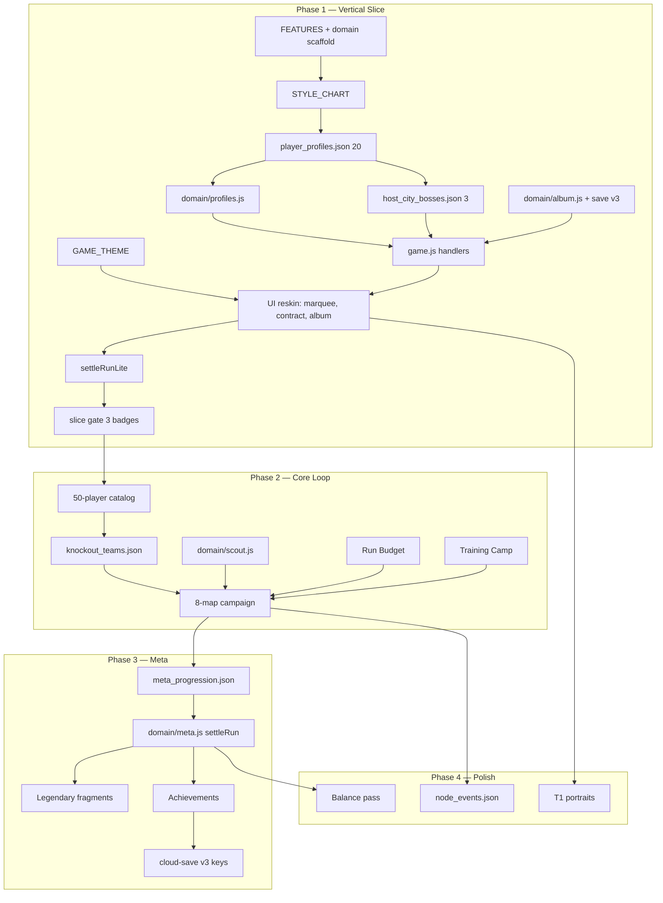

# SPEC 010 — Vertical Slice Implementation Plan

**Status:** Authoritative implementation plan — engineering execution order  
**Authority:** Implements [006B](./006B-technical-blueprint-revised.md), [007](./007-football-data-pack.md), [008](./008-meta-progression.md), [009](./009-gameplay-loop-node-system.md) with explicit phase cuts  
**Inputs:** [001](./001-codebase-discovery.md)  
**Version:** v1.0  
**Date:** 2026-06-06  
**Scope:** Implementation plan only — not game design, not product design

---

## 1. Purpose

Ship the **smallest playable football build** that validates the core fantasy before investing in full campaign, meta economy, or polish.

**Assumptions:**

- Single developer
- Existing Pokelike vanilla JS engine (`index.html` + 7 JS modules)
- Browser game, no build step for MVP
- MVP-first: reuse battle, map DAG, node handlers, save semantics

**Primary validation goals (Phase 1):**

| # | Hypothesis | How we know it works |
|---|------------|----------------------|
| 1 | Football theme reads instantly | No Pokémon copy in slice UI; real player names on cards |
| 2 | Scout Reports feel like football recruitment | 3-player report → Contract Offer → squad add |
| 3 | Contract Offers are satisfying | 100% sign on pick; swap when squad full |
| 4 | Squad building has decisions | Reach 4–6 players across 3 host legs |
| 5 | Host City progression motivates | 3 City Stamps with federation boss fights |
| 6 | Album drives rerun intent | Seen/signed states persist; settlement shows new stickers |

---

## 2. Phase Overview

```
Phase 1 — Vertical Slice     1–2 weeks   Playable demo (3 cities)
Phase 2 — Core Loop        2–3 weeks   Full 8-city campaign + knockout
Phase 3 — Meta Progression 2–3 weeks   Credits, fragments, achievements
Phase 4 — Polish           2+ weeks   Events, UX, balance, audio
```

| Phase | Player experience | Technical theme |
|-------|-------------------|-----------------|
| **1** | Marquee → 3 maps → 3 stamps → slice-complete screen | Domain layer + football catalog + album |
| **2** | 8 maps → knockout gauntlet → win/lose | Boss JSON, knockout chain, Run Budget |
| **3** | Every run earns permanent progress | Settlement economy, fragments, achievements |
| **4** | Memorable, tuned, polished | Events, animations, balance pass |

---

## 3. Phase 1 — Vertical Slice

### 3.1 Scope boundary

**Must include:**

| Feature | Slice definition |
|---------|------------------|
| Football player data | `player_profiles.json` — **minimum 20 profiles** (see §3.2) |
| 3 starters | Mbappé (1), Messi (2), Van Dijk (3) |
| Scout Reports | Engine `catch` node → 3-player weighted pool |
| Contract Offers | Reskin `doCatchNode` / `catch-screen`; 100% sign on pick |
| Squad of 6 | Existing `maxTeamSize` cap; swap screen reskinned |
| 3 Host Cities | São Paulo (0), Berlin (1), Tokyo (2) |
| 3 Bosses | Host city challenges from `host_city_bosses.json` (maps 0–2 only) |
| Album Seen/Signed | `game_album` `{ profileId: 0\|1 }`; basic album modal |
| Settlement | End-of-slice summary: signs, album %, run stats — **no credits/fragments** |

**Must exclude (defer):**

| Feature | Deferred to |
|---------|-------------|
| Legends / Legendary nodes | Phase 2 (nodes) / Phase 3 (fragments) |
| Fragments | Phase 3 |
| Knockout stage | Phase 2 |
| Named World Cup events | Phase 4 |
| Mystery event redesign | Phase 4 (question → battle/trainer only in slice) |
| Achievements | Phase 3 |
| Cloud save UI | Phase 4 (hidden/gated Phase 1) |
| Meta progression (Football Credits, duplicates) | Phase 3 |
| Run Budget | Phase 2 |
| Training Camp node | Phase 2 |
| Full 50-player roster | Phase 2 (author all 50; load subset in slice) |
| Continental Champions Cup | Never in MVP |

### 3.2 Phase 1 content pack (minimum viable data)

Author **20 profileIds** in `data/football/player_profiles.json`:

| Bucket | profileIds | Players |
|--------|------------|---------|
| Starters | 1–3 | Mbappé, Messi, Van Dijk |
| Early scouts | 4, 6, 7, 9, 10, 12, 14, 15, 17, 18, 28 | Haaland, Modrić, Salah, Rodri, Bellingham, Pedri, Kanté, Ramos, Alisson, Marcelo, Robben |
| Host heroes | 29–31 | Casemiro, Kroos, Kubo |
| Boss roster fillers | 16, 22, 26 | Neuer, Cafu, Beckenbauer (Berlin); 7, 28 (Tokyo) |

Author **3 entries** in `data/football/host_city_bosses.json` (maps 0–2 per [007 §7](./007-football-data-pack.md)).

Author **2 pages** in `data/football/album_layout.json`:

- `marquee` — slots 1, 2, 3
- `favorites` — slots 4–18 (only IDs present in slice roster)

**Style system:** Full `STYLE_CHART` (18 styles) — same balance as `TYPE_CHART`; only slice roster uses football labels.

### 3.3 Phase 1 campaign flow

```
Title → Manager (cosmetic) → Marquee Signing (1 of 3)
    → Map 0 São Paulo → … → Boss → Stamp 1
    → Map 1 Berlin   → … → Boss → Stamp 2
    → Map 2 Tokyo    → … → Boss → Stamp 3
    → Slice Complete screen → Settlement → Title
```

**Slice end trigger:** `state.badges === 3` → skip maps 3–7 and knockout → `showSliceCompleteScreen()`.

**Map 0 script (required):** Second node on layer 1 forced Scout Report with pool `{12, 15, 17}` (Pedri, Ramos, Alisson).

**Node types in slice:**

| Node | Engine type | Slice behavior |
|------|-------------|----------------|
| Scout Report | `catch` | 3 choices, Contract Offer |
| Friendly Match | `battle` | +1 form level |
| Recovery Center | `pokecenter` | Full heal |
| Gear Crate | `item` | Pick 1 of 3 (optional — can stub with existing items) |
| Rival National Team | `trainer` | +2 form level |
| Specialist Coach | `move_tutor` | Skill tier +1 |
| Host City Challenge | `boss` | JSON roster, City Stamp |
| Mystery | `question` | **Slice:** battle or trainer only — no named events |

**Disabled in slice:** `trade` (weight 0), `legendary` (weight 0), `silver`, CCC entry.

### 3.4 Phase 1 engineering deliverables

| Deliverable | Definition of done |
|-------------|-------------------|
| `js/domain/` scaffold | `styles.js`, `profiles.js`, `album.js`, `bosses.js`, `save.js`, `combat-adapter.js`, `features.js` |
| Football catalog loads | `createPlayerInstance()` replaces `createInstance()` + PokeAPI for `profileId ≤ 20` |
| `GAME_THEME` object | Centralized terminology; no Pokémon strings in slice screens |
| Save v3 migration (album only) | `poke_dex` → `game_album`; no credits/fragments keys yet |
| Album UI | Seen silhouette / signed portrait; open from map HUD |
| Settlement (lite) | `settleRunLite(snapshot)` — album patches + summary modal only |
| Slice gate | Campaign stops at 3 badges; no knockout transition |
| Feature flags | `FEATURES.footballMode = true`, `FEATURES.sliceMode = true`, `FEATURES.maxMapIndex = 2` |

### 3.5 Phase 1 — file change map

| File | Effort | Changes |
|------|--------|---------|
| **data.js** | **HIGH** | `STARTER_IDS = [1,2,3]`; re-export `STYLE_CHART` from domain; deprecate PokeAPI path for football IDs; `GAME_THEME` constants; gate `GYM_LEADERS` / `ELITE_4` behind `FEATURES.footballMode` |
| **game.js** | **HIGH** | Init domain on boot; `doCatchNode` → scout + album seen; `doBossNode` → `domain/bosses.getHostCity()`; slice end at `badges === 3`; `settleRunLite()` on slice complete / game over; `runId` + minimal ledger (`seenProfileIds`, `signedProfileIds`); bypass `checkAndEvolveTeam` for football profiles |
| **map.js** | **MEDIUM** | `FEATURES.maxMapIndex` caps `generateMap`; football node labels in tooltips; Map 0 forced scout slot; `catch` weight bump on L1; `legendary`/`trade` weight 0 |
| **battle.js** | **LOW** | `GAME_THEME.battle` log strings; optional `getCombatMove` inject — math unchanged |
| **ui.js** | **HIGH** | Marquee signing screen; Contract Offer / Squad Registration reskin; album modal (2 pages); slice-complete screen; settlement summary (no credits UI); player cards via `domain/profiles`; hide Pokédex/Achievements/CCC buttons |
| **cloud-save.js** | **LOW** | Hide cloud UI when `FEATURES.cloudSave === false`; no schema changes in slice |

### 3.6 Phase 1 — what to mock

| System | Mock strategy |
|--------|---------------|
| Player portraits | T0 jersey silhouette (`onerror` → nation flag + number) |
| City stamps | Text + nation flag CSS (no stamp PNG required) |
| Gear Crate items | Reuse existing `ITEM_POOL` with `GAME_THEME` display names |
| Host city backgrounds | Reuse existing map chrome |
| Knockout / elite flow | Not reachable — `ELITE_4` handlers never called in slice |
| Meta currency | Settlement shows "Coming soon" or omits credits line entirely |
| Full 50-player album | Show 20 slots; locked "Vol. 1 complete in full campaign" footer |

### 3.7 Phase 1 — implementation order (single developer)

**Week 1 — Engine + data foundation**

| Day | Task | Blocks |
|-----|------|--------|
| 1 | Create `js/domain/` (7 files) + `FEATURES` flags; update `index.html` script order | Everything |
| 1 | `domain/styles.js` — `StyleId`, `STYLE_CHART`, labels | Catalog, battle |
| 2 | `player_profiles.json` (20 players) + `domain/profiles.js` + `combat-adapter.js` | Starters, scouts, bosses |
| 2 | `host_city_bosses.json` (3 bosses) + `domain/bosses.js` | Boss fights |
| 3 | `domain/save.js` — v3 album migration only; `domain/album.js` | Album persistence |
| 3 | `GAME_THEME` + replace starter flow (`STARTER_IDS`, marquee screen) | First playable path |
| 4 | Wire `doBossNode` / `doCatchNode` to domain; bypass evolution | Core loop |
| 4 | `FEATURES.sliceMode` — end run at 3 badges | Slice boundary |
| 5 | Map 0 forced scout + album `markSeen` on scout display | Onboarding |

**Week 2 — UI + validation**

| Day | Task | Blocks |
|-----|------|--------|
| 6 | Contract Offer + Squad Registration reskin (`catch-screen`, `swap-screen`) | Recruitment UX |
| 7 | Album modal (marquee + favorites pages) | Collection validation |
| 8 | `settleRunLite()` + slice-complete / game-over summary | Run end |
| 9 | Hide Pokémon mode UI (gen toggle, CCC, cloud, achievements) | Football-only demo |
| 10 | Manual playtest: 3 full slice runs; fix blockers | Ship gate |

---

## 4. Phase 2 — Core Loop Complete

### 4.1 Scope

**Add:**

| Feature | Source spec |
|---------|-------------|
| All 8 Host Cities | [007 §7](./007-football-data-pack.md) |
| Full 50-player catalog | [007 §3](./007-football-data-pack.md) |
| Knockout stage (5 gates) | [007 §8](./007-football-data-pack.md), [009 §10](./009-gameplay-loop-node-system.md) |
| Run Budget (earn-only) | [009 §8](./009-gameplay-loop-node-system.md) |
| Training Camp node | [009 §7.2](./009-gameplay-loop-node-system.md) |
| Federation Challenge (optional trainer) | [009 §3.1](./009-gameplay-loop-node-system.md) |
| Elite guarantee scout | [009 §4.7](./009-gameplay-loop-node-system.md) |
| Knockout Draw Ceremony + Matchday Squad Selection | [009 §10.1](./009-gameplay-loop-node-system.md) |
| Full album (5 pages) | [007 §9](./007-football-data-pack.md) |
| Legendary nodes (weight only — fragments in Phase 3) | Map 5+, offer placeholder or "coming in meta update" |

**Remove slice limits:**

- `FEATURES.sliceMode = false`
- `FEATURES.maxMapIndex = 7`
- `badges === 8` → knockout transition

### 4.2 Phase 2 — file change map

| File | Effort | Changes |
|------|--------|---------|
| **data.js** | **MEDIUM** | Load full catalog; `knockout_teams.json` reference; `scout_pools.json`; `run_economy.json`; item display renames ([007 §11](./007-football-data-pack.md)) |
| **game.js** | **HIGH** | Knockout chain (`eliteIndex` 0–4) loads JSON teams; `doTrainingCampNode`; Run Budget earn hooks; `runLedger` extensions; win → World Cup screen; `FEATURES.sliceMode` off |
| **map.js** | **MEDIUM** | Full 8-map weights; `training_camp` type; `legendary` weight 2 on map 5+; `catch` 1.15× on map 5+ |
| **battle.js** | **LOW** | Training camp `enemyStatMultiplier`; knockout level bands from JSON |
| **ui.js** | **HIGH** | Knockout prep screen reskin; historical team preview; Run Budget HUD counter; full 5-page album; badge → City Stamp ceremony |
| **cloud-save.js** | **LOW** | Still hidden; prepare `game_album` in `SYNC_KEYS` list (no UI) |

### 4.3 Phase 2 — implementation order

1. Expand `player_profiles.json` to 50; `host_city_bosses.json` to 8; add `knockout_teams.json`, `scout_pools.json`, `album_layout.json` (full)
2. `domain/scout.js` — `buildReport()`, elite guarantee, stage pools
3. Remove slice gate; wire knockout from `doBossNode` map 7 win → `eliteIndex` chain
4. `domain/run-economy.js` — Run Budget earn (no spend)
5. Training Camp handler + map weights
6. UI: knockout ceremony, prep screen, Run Budget float
7. Balance pass on boss form levels ([007 §13](./007-football-data-pack.md))

---

## 5. Phase 3 — Meta Progression

### 5.1 Scope

**Add:**

| Feature | Source spec |
|---------|-------------|
| Football Credits | [008 §5](./008-meta-progression.md) |
| Duplicate conversion | [008 §7](./008-meta-progression.md) |
| Legend fragments + unlocks | [008 §8](./008-meta-progression.md) |
| Full settlement algorithm | [008 §18](./008-meta-progression.md) |
| Achievements (6 MVP + 8 expansion) | [007 §10](./007-football-data-pack.md), [008 §10](./008-meta-progression.md) |
| Album milestone rewards | [008 §6](./008-meta-progression.md) |
| Legendary node — Fragment Discovery / Contract Offer branch | [009 §5.6](./009-gameplay-loop-node-system.md) |
| Account flags + meta unlock levels | [008 §11](./008-meta-progression.md) |
| `meta_progression.json` | [008 §4.7](./008-meta-progression.md) |

### 5.2 Phase 3 — file change map

| File | Effort | Changes |
|------|--------|---------|
| **data.js** | **MEDIUM** | `achievements_mvp.json` loader; achievement ID migration map |
| **game.js** | **HIGH** | `domain/meta.js` `settleRun()` replaces lite; `runSnapshot` builder; `duplicateSignProfileIds` ledger; legendary node fragment branch; `runId` dedupe |
| **map.js** | **LOW** | No structural changes |
| **battle.js** | **LOW** | No changes |
| **ui.js** | **HIGH** | Settlement breakdown modal; credits/fragments display; title screen meta summary; achievement toasts; pending-credits HUD ([009 §14.3](./009-gameplay-loop-node-system.md)) |
| **cloud-save.js** | **MEDIUM** | v3 `SYNC_KEYS` expansion; merge rules for `game_album`, `legendFragments`; re-enable UI when ready |

### 5.3 Phase 3 — implementation order

1. `meta_progression.json` + `domain/meta.js` (`settleRun`, pure functions)
2. Extend `domain/save.js` — full v3 account blob; `applyAccountPatch()`
3. Replace `settleRunLite` on win/game-over/abandon
4. Legendary node locked/unlocked branch
5. Achievement evaluation + reward claim dedupe
6. UI settlement + title meta readout
7. Golden tests ([008 §21](./008-meta-progression.md)) — manual QA checklist minimum

---

## 6. Phase 4 — Polish

### 6.1 Scope

**Add:**

| Feature | Source spec |
|---------|-------------|
| Named World Cup events (6-event pool) | [009 §16.2](./009-gameplay-loop-node-system.md) |
| `domain/events.js` | [009 §3.2](./009-gameplay-loop-node-system.md) |
| UX improvements | [009 §14](./009-gameplay-loop-node-system.md) |
| Balance tuning | [007 §13](./007-football-data-pack.md), [009 §12](./009-gameplay-loop-node-system.md) |
| T1 illustrated portraits | [006B §9](./006B-technical-blueprint-revised.md) |
| Audio (SFX stubs) | New — not in prior specs |
| Cloud save re-enable | [006B §10.5](./006B-technical-blueprint-revised.md) |
| Animations | Contract stamp, fragment pip, album sticker pop |

### 6.2 Phase 4 — file change map

| File | Effort | Changes |
|------|--------|---------|
| **data.js** | **LOW** | `node_events.json` loader |
| **game.js** | **MEDIUM** | `doNamedEventNode`; question roll 0.65–1.00 → events |
| **map.js** | **LOW** | Event node meta labels |
| **battle.js** | **LOW** | Balance constants only |
| **ui.js** | **HIGH** | Event choice modals; animation pass; portrait upgrade; audio hooks |
| **cloud-save.js** | **MEDIUM** | Re-enable auth UI; v3 sync QA |

---

## 7. Codebase Mapping Summary

Effort key: **LOW** = hours–1 day · **MEDIUM** = 1–3 days · **HIGH** = 3–5+ days

### 7.1 By file across all phases

| File | Phase 1 | Phase 2 | Phase 3 | Phase 4 | Cumulative |
|------|---------|---------|---------|---------|------------|
| **data.js** | HIGH | MEDIUM | MEDIUM | LOW | HIGH |
| **game.js** | HIGH | HIGH | HIGH | MEDIUM | HIGH |
| **map.js** | MEDIUM | MEDIUM | LOW | LOW | MEDIUM |
| **battle.js** | LOW | LOW | LOW | LOW | LOW |
| **ui.js** | HIGH | HIGH | HIGH | HIGH | HIGH |
| **cloud-save.js** | LOW | LOW | MEDIUM | MEDIUM | MEDIUM |
| **js/domain/** (new) | HIGH | MEDIUM | HIGH | MEDIUM | HIGH |
| **data/football/** (new) | HIGH | MEDIUM | LOW | LOW | HIGH |

### 7.2 New modules by phase

| Module | Phase 1 | Phase 2 | Phase 3 | Phase 4 |
|--------|---------|---------|---------|---------|
| `domain/styles.js` | ✅ | — | — | — |
| `domain/profiles.js` | ✅ | extend 50 | — | — |
| `domain/album.js` | ✅ | extend pages | extend milestones | — |
| `domain/bosses.js` | ✅ 3 cities | extend 8+5 KO | — | — |
| `domain/save.js` | ✅ album v3 | — | ✅ full v3 | — |
| `domain/combat-adapter.js` | ✅ | — | — | — |
| `domain/features.js` | ✅ | extend flags | extend flags | — |
| `domain/scout.js` | stub | ✅ | — | — |
| `domain/recruit.js` | ✅ | — | duplicates | — |
| `domain/run-economy.js` | — | ✅ | extend settlement | — |
| `domain/meta.js` | lite | — | ✅ | — |
| `domain/events.js` | — | — | — | ✅ |
| `domain/skills.js` | optional | ✅ | — | — |

---

## 8. Technical Risks & Mitigation

### 8.1 Save migration risks

| Risk | Severity | Mitigation |
|------|----------|------------|
| `poke_dex` shape mismatch on migration | HIGH | Idempotent `migrateSaveV2toV3()` in `domain/save.js`; read fallback `game_album` ?? `poke_dex` for one release |
| Active run has Pokémon `speciesId` after mode switch | MEDIUM | Football slice uses fresh runs only; migration does not rewrite active `poke_current_run` team |
| Dual-write `poke_dex` + `game_album` | HIGH | Single write path: album facades only post-migration |
| Cloud merge conflicts on album | MEDIUM | Defer to Phase 3; per-key max merge ([008 §17.3](./008-meta-progression.md)) |

### 8.2 Data model risks

| Risk | Severity | Mitigation |
|------|----------|------------|
| `speciesId` confusion vs `profileId` | MEDIUM | `createPlayerInstance` sets both equal; JSDoc on instance type |
| PokeAPI fetch for football ID | HIGH | Guard: `if (profileId <= 50) return catalog` — no network |
| Style chart drift from type chart | MEDIUM | Unit test: `STYLE_CHART` keys differ but matrix values identical to `TYPE_CHART` |
| 50-player cap forces knockout stand-ins | LOW | Accept for MVP; document in boss flavor text ([007 §14](./007-football-data-pack.md)) |
| Messi on starter squad vs boss squad (gate 4) | MEDIUM | Same `profileId` allowed; engine already handles duplicate species in enemy team |

### 8.3 UI risks

| Risk | Severity | Mitigation |
|------|----------|------------|
| `ui.js` monolith (~4500 lines) | HIGH | Domain facades for data; reskin screens incrementally; avoid new modal frameworks |
| Missed Pokémon string | MEDIUM | `GAME_THEME` grep gate; manual QA checklist before slice demo |
| Album modal complexity | MEDIUM | Phase 1: 2 pages only; defer legends hidden page to Phase 2 |
| Settlement UI scope creep | MEDIUM | Phase 1: lite summary only; full breakdown Phase 3 |

### 8.4 Performance risks

| Risk | Severity | Mitigation |
|------|----------|------------|
| JSON catalog fetch on boot | LOW | Inline `<script>` or sync XHR for MVP; 50 profiles < 100KB |
| PokeAPI on slow network | HIGH | Remove from football hot path entirely (Phase 1) |
| `localStorage` quota on album + ledger | LOW | Compact `{ id: 0\|1 }` shape; ledger cleared on settlement |
| Battle animation + domain async | MEDIUM | Keep `runGeneration` guard on all post-battle callbacks |

---

## 9. Dependency Graph



### 9.1 Critical path (nothing else can start until these land)

1. `js/domain/` + `FEATURES`
2. `STYLE_CHART` + `player_profiles.json` (starters minimum)
3. `domain/profiles.js` → `createPlayerInstance`
4. `GAME_THEME` + marquee signing
5. `doCatchNode` / `doBossNode` wired to domain

### 9.2 Can wait (not on Phase 1 critical path)

| Item | Wait until |
|------|------------|
| Knockout teams JSON | Phase 2 |
| Run Budget | Phase 2 |
| `meta_progression.json` | Phase 3 |
| Legend fragments UI | Phase 3 |
| Named events | Phase 4 |
| T1 portraits | Phase 4 (use T0 silhouettes) |
| Cloud save | Phase 4 |
| Golden automated tests | Phase 2+ (manual QA sufficient for slice) |
| `endless.js` changes | Never — gate `FEATURES.continentalCup = false` |

### 9.3 Can mock in Phase 1

| Item | Mock |
|------|------|
| Portraits | Jersey silhouette + nation flag |
| City stamps | Text badge |
| Item names | English rename in `GAME_THEME` only |
| Settlement economy | "Album updated" summary without credits |
| Maps 3–7 | Not generated — slice ends at Tokyo |
| Knockout | Unreachable code path |

---

## 10. Success Criteria

### 10.1 Phase 1 — Vertical Slice success

**Definition:** A player can complete one football slice run in ~15–20 minutes and understand what the full game will be.

#### Must-work player actions

| Action | Expected result |
|--------|-----------------|
| Pick marquee signing | 1 of Mbappé / Messi / Van Dijk enters squad |
| Click Scout Report | 3 real player cards shown; album marks seen |
| Offer contract | Player joins squad (or swap if 6 full) |
| Win Host City Challenge | City Stamp increments; boss roster from JSON |
| Open album | Seen = silhouette; signed = name + portrait |
| Complete 3 stamps | Slice-complete screen → settlement summary |
| Start run 2 | Fresh squad; album persists from run 1 |
| Lose a battle | Game over → settlement still runs |

#### Qualitative gates

| Gate | Pass condition |
|------|----------------|
| Football identity | Playtester names a player and a host city unprompted |
| Recruitment hook | Playtester signs ≥2 scouts beyond marquee in slice |
| Collection hook | Playtester opens album after run 1 |
| No Pokémon bleed | Zero Pokémon terms in slice UI (automated grep + manual) |

#### Phase 1 metrics (internal)

| Metric | Target |
|--------|--------|
| Slice completion rate | ≥70% of dev playtests finish 3 stamps |
| Time to first stamp | ≤8 minutes |
| Scouts per slice run | ≥3 signings beyond marquee |
| Critical bugs | 0 blockers (crash, soft-lock, save loss) |

### 10.2 Phase 2 readiness indicators

Proceed to Phase 2 when **all** are true:

- [ ] Phase 1 playtest gate passed (§10.1)
- [ ] `createPlayerInstance` stable — no PokeAPI fallback for football IDs
- [ ] Album seen/signed persists across 3+ consecutive runs
- [ ] Boss loading from JSON works for 3 cities without hardcoded `GYM_LEADERS`
- [ ] No regression in battle engine (existing damage/level math)
- [ ] Developer can add a 4th boss by JSON only (prove data-driven path)
- [ ] `GAME_THEME` covers all player-facing strings in slice

### 10.3 Phase 3 readiness indicators

- [ ] Full 8-city campaign playable start to finish
- [ ] Knockout gate 4 reachable in playtests
- [ ] Run ledger captures `signedProfileIds` and `duplicateSignProfileIds`
- [ ] First-run knockout reach ≥70% in playtests ([009 §12](./009-gameplay-loop-node-system.md))

### 10.4 Full MVP success (post Phase 3)

Aligns with [005 §3](./005-football-mvp-definition.md) and [009 §19](./009-gameplay-loop-node-system.md):

| Metric | Target |
|--------|--------|
| Median campaign duration | 35–40 min |
| First-run knockout reach | ≥70% |
| First-run World Cup win | 15–25% |
| Second-run start rate | ≥60% same session |
| Album opened post-run | ≥50% |

---

## 11. Testing Strategy (by phase)

| Phase | Minimum QA |
|-------|------------|
| **1** | Manual: marquee → 3 stamps × 3 runs; album persistence; game over settlement |
| **2** | Manual: full campaign win + loss at each knockout gate; [009 §15](./009-gameplay-loop-node-system.md) golden scenarios G1–G13 |
| **3** | Manual + JSON fixtures: [008 §21](./008-meta-progression.md) G1–G10 |
| **4** | Playtest session with 3 external testers; balance pass on gate 2 and gate 4 |

**Automated tests (recommended, not blocking Phase 1):**

- `STYLE_CHART` parity with `TYPE_CHART` values
- `settleRun` golden JSON (Phase 3)
- `migrateSaveV2toV3` idempotency (Phase 3)

---

## 12. Script Load Order (target)

Phase 1 update to `index.html`:

```
domain/features.js
domain/styles.js
domain/profiles.js
domain/album.js
domain/bosses.js
domain/combat-adapter.js
domain/save.js
domain/recruit.js
data.js
map.js
battle.js
endless.js
ui.js
game.js
cloud-save.js
```

Async JSON loads (profiles, bosses) initiated in `domain/profiles.js` / `domain/bosses.js` `initCatalog()` called from `initGame()` before first run.

---

## 13. Phase 1 Acceptance Checklist

Engineering gate before starting Phase 2:

### Data & domain
- [ ] `data/football/player_profiles.json` — 20 players with authored stats
- [ ] `data/football/host_city_bosses.json` — maps 0, 1, 2
- [ ] `data/football/album_layout.json` — marquee + favorites (slice IDs)
- [ ] `STARTER_IDS = [1, 2, 3]` (Messi not Modrić per [007 §2](./007-football-data-pack.md))
- [ ] `SAVE_SCHEMA_VERSION = 3`; `game_album` migration on boot
- [ ] PokeAPI not called for `profileId <= 50`

### Gameplay
- [ ] Scout Report shows 3 players; Map 0 layer-1 forced pool `{12, 15, 17}`
- [ ] Contract Offer signs on pick; skip available
- [ ] Squad cap 6 with Squad Registration swap
- [ ] 3 Host City bosses winnable; stamps increment
- [ ] Campaign ends at stamp 3 with slice-complete flow
- [ ] `checkAndEvolveTeam` does not rename football players

### UI
- [ ] Marquee Signing screen with style triangle hint
- [ ] No Pokémon terminology in slice screens
- [ ] Album modal: seen/signed states
- [ ] Settlement lite modal on slice complete and game over
- [ ] CCC, cloud save, gen toggle, achievements hidden

### Persistence
- [ ] Album survives page reload between runs
- [ ] Active run saves/restores mid-slice
- [ ] `runId` stored in run state (for Phase 3 dedupe)

---

## 14. Open Implementation Decisions (resolve in Phase 1, Day 1)

| # | Decision | Recommendation | Blocks |
|---|----------|----------------|--------|
| 1 | JSON load: fetch vs inline | `fetch` + `initCatalog()` async gate on title screen | Boot flow |
| 2 | Football-only mode vs dual mode | `FEATURES.footballMode = true` hides Pokémon UI; keep engine code paths | UI scope |
| 3 | Slice complete vs early access message | "Vertical Slice — 3 of 8 host cities" honest label | Expectations |
| 4 | Game over before stamp 3 | Allow — settlement lite still runs | Failure path |
| 5 | Question node in slice | Battle/trainer only — skip named events | Scope |

---

## 15. Final Recommendation

**Start Phase 1 immediately.** The existing Pokelike engine already has 80% of the mechanics (map DAG, catch flow, boss flow, album-shaped dex, auto-battle). The vertical slice deliberately defers knockout, meta economy, and legends to prove the **football recruitment + host city + album** triangle in 1–2 weeks.

**Highest ROI sequence:**

1. Domain layer + 20-player catalog (unblocks everything)
2. Marquee + Contract Offer reskin (proves theme)
3. JSON bosses for 3 cities (proves data-driven content)
4. Album + lite settlement (proves retention hook)
5. Slice gate + demo polish

Do **not** start Phase 2 until the Phase 1 acceptance checklist (§13) is green. Phase 2 is primarily **content expansion + knockout wiring** — it moves faster if the domain layer is clean.

---

## Appendix A — Phase 1 player roster (quick reference)

| ID | Player | Role in slice |
|----|--------|---------------|
| 1 | Mbappé | Starter |
| 2 | Messi | Starter |
| 3 | Van Dijk | Starter |
| 4 | Haaland | Scout |
| 6 | Modrić | Scout |
| 7 | Salah | Scout |
| 9 | Rodri | Scout |
| 10 | Bellingham | Scout |
| 12 | Pedri | Scout (Map 0 forced) |
| 14 | Kanté | Scout |
| 15 | Ramos | Scout (Map 0 forced) |
| 17 | Alisson | Scout (Map 0 forced) |
| 18 | Marcelo | Scout |
| 28 | Robben | Scout |
| 29 | Casemiro | São Paulo boss |
| 30 | Kroos | Berlin boss |
| 31 | Kubo | Tokyo boss |
| 16 | Neuer | Berlin boss roster |
| 22 | Cafu | São Paulo boss roster |
| 26 | Beckenbauer | Berlin boss roster |

---

## Appendix B — Pokelike → Slice mapping

| Pokelike | Phase 1 football |
|----------|------------------|
| `STARTER_IDS [1,4,7]` | `[1,2,3]` Mbappé, Messi, Van Dijk |
| `doCatchNode` | Scout Report → Contract Offer |
| `catch-screen` | Contract Offer screen |
| `swap-screen` | Squad Registration |
| `GYM_LEADERS[n]` | `host_city_bosses.json[n]` |
| `getPokedex()` | `domain/album.getAlbum()` |
| `markDex` / caught | `markAlbumSigned` |
| `badge-screen` | City Stamp ceremony |
| `ELITE_4` chain | Disabled (slice ends at 3 badges) |
| `win-screen` | Slice Complete screen |
| `checkAndEvolveTeam` | No-op for football `profileId` |

---

*End of SPEC 010 — Vertical Slice Implementation Plan.*
