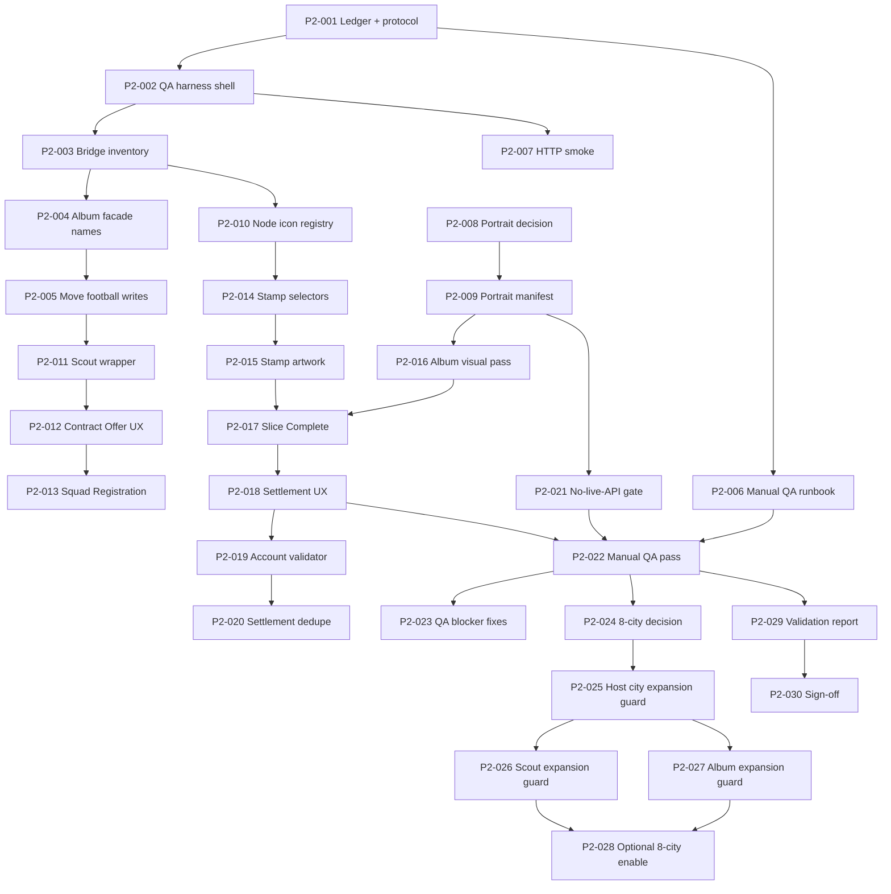

# SPEC 012 — Phase 2 Polish, Debt Retirement, and Football-Native UX Plan

**Status:** Proposed Phase 2 implementation plan  
**Authority:** Follows Phase 1 sign-off in [011](./011-engineering-task-breakdown.md), assumptions/debt in [012](./012-phase-1-assumptions-tradeoffs-report.html), and visual friction registry in [013](./013-phase-2-visual-frictions.html)  
**Inputs:** [006B](./006B-technical-blueprint-revised.md), [007](./007-football-data-pack.md), [008](./008-meta-progression.md), [009](./009-gameplay-loop-node-system.md), [010](./010-vertical-slice-implementation-plan.md), [011](./011-engineering-task-breakdown.md), [012](./012-phase-1-assumptions-tradeoffs-report.html), [013](./013-phase-2-visual-frictions.html)  
**Version:** v0.1  
**Date:** 2026-06-10  
**Execution model:** One atomic task per commit. Keep the game playable after every task. No automated screenshots unless explicitly requested.

---

## 1. Executive Summary

Phase 1 proved the vertical slice: football mode boots, data loads from domain JSON, three Host City Challenges are playable, Scout Report and Contract Offer flows work, album/save v3 persists, settlement lite runs on win/loss, cloud save stays disabled, and `npm run validate` gates domain, QA, docs, and syntax.

Phase 2 should not widen scope immediately. The next milestone is to make the slice feel football-native and release-safe while retiring the highest-value temporary bridges. The order is deliberate:

1. Establish Phase 2 validation and manual QA ledgers.
2. Remove or isolate bridges that are safe to retire without touching battle math.
3. Convert high-traffic screens from reskinned legacy surfaces into football-native components.
4. Replace release-risk visual language and third-party portrait dependency with owned/stylized asset contracts.
5. Harden account/save domain boundaries without reactivating cloud save.
6. Prepare 8 Host City expansion only after the three-city slice is stable, validated, and visually coherent.

The core product principle is continuity: every task must leave a working playable build. Architecture improves through narrow seams, not a rewrite.

---

## 2. Phase 2 Goals

- Reduce legacy Pokémon bridges where football behavior is already proven.
- Make Scout Report, Contract Offer, Squad Registration, City Stamp, Album, Slice Complete, and Settlement Lite feel football-native.
- Replace legacy icon/sprite semantics with football node, stamp, squad, and album visual language.
- Define an asset strategy that works for public release without live TheSportsDB runtime dependency.
- Strengthen `domain/save.js`, album, run identity, and account patch contracts while preserving vanilla JS runtime.
- Expand automated QA from source-contract checks into real loop simulation where practical.
- Add manual QA discipline for first-run onboarding, full-squad swap, win/loss settlement, and reload persistence.
- Prepare 3-to-8 Host City expansion only after UX/debt gates pass.

---

## 3. Non-Goals

- No React/Next migration in Phase 2 implementation. New code should remain portable, but runtime stays vanilla.
- No battle math rewrite unless a specific task explicitly scopes it.
- No cloud save reactivation.
- No live TheSportsDB, PokeAPI, or other external API calls in runtime-critical paths.
- No public release claim until portrait/legal/art decisions are resolved.
- No full content expansion before slice UX, save/account contracts, and validation are stable.
- No wholesale removal of Classic/legacy code unless a task proves football mode and legacy compatibility remain safe.
- No combined mega-task that mixes save migration, visual polish, and content expansion.

---

## 4. Current Phase 1 Baseline

Phase 1 is complete in SPEC 011:

- `52/52` Phase 1 tickets done.
- `npm run validate` passes:
  - football domain validation,
  - Phase 1 QA harness,
  - docs validation,
  - syntax checks.
- Football mode is default and gates deferred systems.
- Cloud save is disabled and validated inert.
- Save schema v3 exists with album migration.
- `game_album` is the account collection source of truth.
- Active run persistence carries `runId` and `ledger`.
- The playable slice ends at 3 City Stamps with settlement lite.
- Visual debt is tracked in SPEC 013.
- Manual screenshots were intentionally skipped in Phase 1.

Important limitation: Phase 1 sign-off was scripted. Phase 2 must add manual loop QA and targeted runtime smoke checks before broader content expansion.

---

## 5. Known Bridges To Retire

| Bridge | Current reason | Phase 2 direction | Retire when |
|--------|----------------|-------------------|-------------|
| `speciesId` overloaded as `profileId` | Battle/save/UI compatibility | Add football-facing helpers and reduce direct call-site dependency | Domain/save/battle adapters prove stable |
| Legacy `markPokedexSeen/Caught` facades | Avoid missed legacy write sites | Introduce football album facade names and update football call sites | Grep confirms football paths no longer call dex-named APIs |
| Legacy `catch-screen` / `swap-screen` containers | Reused for Scout Report and Squad Registration | Add football-native component wrappers/classes | UI flow and keyboard behavior remain intact |
| Badge DOM/classes for City Stamps | Low-risk ceremony conversion | Add stamp-specific selectors/assets, keep compatibility aliases briefly | Stamp ceremony renders without badge fantasy |
| Legacy type projection | Battle engine compatibility | Make style boundary explicit; do not touch battle math yet | All football instances expose native style data and tests guard projection |
| Legacy node icons | Map generator reuse | Football icon registry for node types | Map node labels/icons are football-native |
| TheSportsDB portrait shortcut | Internal demo visuals | Owned/stylized portrait manifest and fallback pipeline | Public-release paths use local assets only |
| Cloud module loaded but inert | Avoid backend/schema work | Keep disabled, document v3 cloud policy separately | Phase 3 cloud plan exists; not Phase 2 runtime |
| `data.js` compatibility constants | Preserve old callers | Move new logic into domain modules; data.js re-exports only | Validation proves no football hot path depends on legacy data internals |

---

## 6. Visual/UX Frictions To Address

From SPEC 013 and Phase 1 assumptions:

- Real-player portrait licensing is unresolved. TheSportsDB cutouts are internal-demo only.
- T0 silhouette fallback is functional but not final.
- Legacy icon set still carries monster-game semantics.
- City Stamp ceremony uses flag placeholders and badge-era selectors.
- Slice Complete and Settlement Lite are functional but not product-final.
- Scout Report and Squad Registration still ride catch/swap DOM structure.
- Album has correct states but lacks release-quality sticker/album presentation.
- Player cards have football labels but need final portrait, rarity, and comparison affordances.
- Map nodes show football labels, but node art and path affordances need a football pass.

---

## 7. Technical Risks

- **Bridge removal regression:** Removing legacy identifiers too early can break hidden call sites in `game.js`/`ui.js`.
- **Save/account drift:** `game_album`, active run, ledger, and settlement patches must stay separate.
- **Visual-only changes masking behavior regressions:** UI polish must keep domain tests and runtime smoke checks.
- **TheSportsDB/legal risk:** Any public path that relies on third-party likeness is blocked.
- **8-city expansion risk:** Wider content before UX stabilization multiplies QA load.
- **Global script order fragility:** Vanilla globals remain order-sensitive until a build system exists.
- **False confidence from source-only tests:** Phase 2 needs manual playthrough gates and loop simulations.
- **Cloud temptation:** Re-enabling cloud without v3 merge policy can corrupt album/account state.

---

## 8. Proposed Task Sequence

### P2-001

**Title:** Create Phase 2 task ledger and validation protocol  
**Objective:** Establish the Phase 2 equivalent of SPEC 011 with task status, DoD, validation expectations, and commit protocol.  
**Files likely touched:** `docs/014-phase-2-polish-debt-retirement-and-football-native-ux-plan.md`, new `docs/015-phase-2-engineering-task-breakdown.md`, `scripts/validate-docs.mjs`  
**Dependencies:** Phase 1 complete.  
**Implementation notes:** Include columns for implementation, validation, manual QA, assumptions/frictions update, and commit hash.  
**Acceptance criteria:** Phase 2 ledger exists; docs validation checks it is linked and has P2 task IDs.  
**Validation command or manual QA step:** `rtk npm run validate`  
**Risk level:** Low  
**Stop condition:** Stop if docs validation cannot be extended without brittle string-only checks.

### P2-002

**Title:** Add Phase 2 QA harness shell  
**Objective:** Add a separate `validate-phase2-qa.mjs` and wire it into `npm run validate` without changing runtime behavior.  
**Files likely touched:** `package.json`, `scripts/validate-phase2-qa.mjs`, `scripts/validate-docs.mjs`  
**Dependencies:** P2-001  
**Implementation notes:** Start with no-op/manifest checks for Phase 2 spec presence, Phase 1 harness still running, and cloud save disabled.  
**Acceptance criteria:** `npm run validate` runs Phase 1 and Phase 2 checks; failure output identifies P2 gate clearly.  
**Validation command or manual QA step:** `rtk npm run validate`  
**Risk level:** Low  
**Stop condition:** Stop if adding the harness obscures Phase 1 QA failures.

### P2-003

**Title:** Inventory football hot paths still calling legacy dex APIs  
**Objective:** Produce a validated bridge inventory for `markPokedexSeen/Caught`, `getPokedex`, `speciesId`, catch/swap containers, and badge selectors.  
**Files likely touched:** new `docs/016-phase-2-bridge-inventory.md`, `scripts/validate-phase2-qa.mjs`  
**Dependencies:** P2-002  
**Implementation notes:** This is discovery plus validation, not runtime refactor. Categorize each bridge as keep, alias, retire now, or retire later.  
**Acceptance criteria:** Inventory covers bridge owner, risk, current call sites, and proposed retirement task.  
**Validation command or manual QA step:** `rtk npm run validate`  
**Risk level:** Low  
**Stop condition:** Stop if a bridge cannot be classified without reading a runtime file not included in the inventory.

### P2-004

**Title:** Add football album facade names  
**Objective:** Introduce `markAlbumSeen`, `markAlbumSigned`, and football-facing wrappers while preserving old facade behavior.  
**Files likely touched:** `js/domain/album.js`, `js/data.js`, `scripts/validate-football-domain.mjs`, `scripts/validate-phase2-qa.mjs`  
**Dependencies:** P2-003  
**Implementation notes:** Keep old names as aliases for compatibility. Do not remove `markPokedex*` yet.  
**Acceptance criteria:** Football tests use album-named API; old aliases still pass Phase 1 validation.  
**Validation command or manual QA step:** `rtk npm run validate`  
**Risk level:** Medium  
**Stop condition:** Stop if aliasing creates two write paths or weakens monotonic album semantics.

### P2-005

**Title:** Move football gameplay writes to album-named APIs  
**Objective:** Update football-specific call sites to use album facade names instead of dex-named functions.  
**Files likely touched:** `js/game.js`, `js/ui.js`, `scripts/validate-phase2-qa.mjs`  
**Dependencies:** P2-004  
**Implementation notes:** Only football branches. Keep legacy mode untouched.  
**Acceptance criteria:** Phase 2 grep proves football branches do not call dex-named write APIs; Phase 1 no-`poke_dex` checks still pass.  
**Validation command or manual QA step:** `rtk npm run validate`  
**Risk level:** Medium  
**Stop condition:** Stop if a shared branch cannot be separated without changing legacy behavior.

### P2-006

**Title:** Add manual QA runbook  
**Objective:** Create a repeatable manual QA checklist for first-run onboarding, scout, swap, boss, settlement, reload, and game-over paths.  
**Files likely touched:** new `docs/017-phase-2-manual-qa-runbook.md`, `docs/015-phase-2-engineering-task-breakdown.md`  
**Dependencies:** P2-001  
**Implementation notes:** Include expected localStorage setup/clear steps and pass/fail evidence fields. No screenshots required.  
**Acceptance criteria:** Runbook can be followed by a tester without knowing the codebase.  
**Validation command or manual QA step:** `rtk npm run validate`  
**Risk level:** Low  
**Stop condition:** Stop if steps require hidden dev tooling not available through the browser.

### P2-007

**Title:** HTTP smoke script for local playable boot  
**Objective:** Add a Node smoke test that serves the static app and verifies key files load without browser screenshots.  
**Files likely touched:** `scripts/smoke-http.mjs`, `package.json`, `scripts/validate-phase2-qa.mjs`  
**Dependencies:** P2-002  
**Implementation notes:** Use the existing static server. Validate `index.html`, key JS, JSON data, and no external runtime API dependency.  
**Acceptance criteria:** `npm run smoke:http` passes locally and is referenced by UI task validation.  
**Validation command or manual QA step:** `rtk npm run validate` and `rtk npm run smoke:http`  
**Risk level:** Low  
**Stop condition:** Stop if smoke needs screenshot/browser automation.

### P2-008

**Title:** Decision gate for portrait/legal/art direction  
**Objective:** Decide the public-release asset strategy before replacing portrait paths.  
**Files likely touched:** new `docs/018-portrait-asset-strategy.md`, `013-phase-2-visual-frictions.html`, `docs/015-phase-2-engineering-task-breakdown.md`  
**Dependencies:** P2-001  
**Implementation notes:** Compare options: stylized jersey avatars, commissioned portraits, licensed photo pack. Record legal blocker and owner.  
**Acceptance criteria:** Release-safe target chosen or explicitly blocked; no runtime changes.  
**Validation command or manual QA step:** `rtk npm run validate`  
**Risk level:** High product/legal  
**Stop condition:** Stop before implementation if there is no product/legal decision.

### P2-009

**Title:** Local portrait manifest contract  
**Objective:** Define a local, release-safe portrait manifest that runtime can read without live API calls.  
**Files likely touched:** `data/football/player_profiles.json`, new `data/football/portrait_manifest.json`, `js/domain/profiles.js`, validation scripts  
**Dependencies:** P2-008  
**Implementation notes:** Manifest may initially point to fallback assets. Do not add real likeness art until approved.  
**Acceptance criteria:** Runtime profile display uses local manifest/fallback only; TheSportsDB is not required for playable UI.  
**Validation command or manual QA step:** `rtk npm run validate`  
**Risk level:** Medium  
**Stop condition:** Stop if the chosen asset path is not release-safe.

### P2-010

**Title:** Football-native node icon registry  
**Objective:** Create a registry mapping node types to football labels/icons without changing map generation.  
**Files likely touched:** `js/domain/theme.js` or `js/domain/features.js`, `js/map.js`, `js/ui.js`, `style.css`, validation scripts  
**Dependencies:** P2-003  
**Implementation notes:** Use text/CSS/icon tokens first. Avoid importing image assets until registry is validated.  
**Acceptance criteria:** Map node surfaces have football-native icon metadata; legacy icons remain only as fallback.  
**Validation command or manual QA step:** `rtk npm run validate`; manual map view check from runbook.  
**Risk level:** Medium  
**Stop condition:** Stop if icon changes require map topology changes.

### P2-011

**Title:** Scout Report component wrapper  
**Objective:** Introduce football-native wrapper classes/structure around Scout Report while keeping behavior unchanged.  
**Files likely touched:** `index.html`, `js/ui.js`, `style.css`, validation scripts  
**Dependencies:** P2-005, P2-007  
**Implementation notes:** Keep keyboard/click actions stable. Do not mix with Contract Offer redesign.  
**Acceptance criteria:** Scout Report no longer depends on player-facing catch copy/classes; report still shows three choices.  
**Validation command or manual QA step:** `rtk npm run validate`; runbook Scout Report step.  
**Risk level:** Medium  
**Stop condition:** Stop if existing event handlers cannot be preserved cleanly.

### P2-012

**Title:** Contract Offer UX polish  
**Objective:** Improve the sign/skip/duplicate decision state after selecting a scout candidate.  
**Files likely touched:** `js/ui.js`, `style.css`, validation scripts  
**Dependencies:** P2-011  
**Implementation notes:** Add clearer CTA hierarchy, duplicate messaging, and signed/seen album feedback.  
**Acceptance criteria:** Pick/skip/sign states are distinct and football-native; DomainRecruit behavior unchanged.  
**Validation command or manual QA step:** `rtk npm run validate`; manual sign and skip path.  
**Risk level:** Medium  
**Stop condition:** Stop if this requires changing recruitment domain rules.

### P2-013

**Title:** Squad Registration six-slot layout  
**Objective:** Replace full-squad swap presentation with a football squad-registration layout.  
**Files likely touched:** `index.html`, `js/ui.js`, `style.css`, validation scripts  
**Dependencies:** P2-012  
**Implementation notes:** Keep swap mechanics identical; improve six-slot scanability and incoming-player comparison.  
**Acceptance criteria:** Full squad decision is understandable without monster-party language; selected replacement still signs correctly.  
**Validation command or manual QA step:** `rtk npm run validate`; manual full-squad swap path.  
**Risk level:** Medium  
**Stop condition:** Stop if comparison requires new combat/stat formulas.

### P2-014

**Title:** City Stamp selector and style cleanup  
**Objective:** Remove badge-facing DOM/CSS naming from football ceremony where safe and introduce stamp-specific aliases.  
**Files likely touched:** `index.html`, `js/ui.js`, `style.css`, validation scripts  
**Dependencies:** P2-010  
**Implementation notes:** Keep legacy selectors as compatibility aliases until validation proves no football usage.  
**Acceptance criteria:** Football ceremony references City Stamp selectors/classes in code and docs; no player-facing badge language.  
**Validation command or manual QA step:** `rtk npm run validate`; manual boss win ceremony.  
**Risk level:** Medium  
**Stop condition:** Stop if selector rename would break legacy mode or animation behavior.

### P2-015

**Title:** City Stamp artwork placeholders  
**Objective:** Replace flag-only ceremony placeholders with owned, simple stamp assets.  
**Files likely touched:** `assets/`, `style.css`, `js/ui.js`, `013-phase-2-visual-frictions.html`  
**Dependencies:** P2-014, art decision not blocked by likeness  
**Implementation notes:** Use abstract stamp graphics, host city labels, and nation colors; no protected logos.  
**Acceptance criteria:** Three Phase 1 stamps render consistently and do not use legacy badge sprites.  
**Validation command or manual QA step:** `rtk npm run validate`; manual boss win ceremony.  
**Risk level:** Medium  
**Stop condition:** Stop if asset ownership/source cannot be confirmed.

### P2-016

**Title:** Album visual model pass  
**Objective:** Improve album cards, unknown/seen/signed states, page headers, and progress affordances.  
**Files likely touched:** `js/ui.js`, `style.css`, `data/football/album_layout.json`, validation scripts  
**Dependencies:** P2-009  
**Implementation notes:** Do not change album persistence semantics.  
**Acceptance criteria:** Album clearly distinguishes unknown, seen, signed; no TheSportsDB dependency; progress count remains correct.  
**Validation command or manual QA step:** `rtk npm run validate`; manual album open before/after signing.  
**Risk level:** Medium  
**Stop condition:** Stop if visual state requires changing `game_album` values.

### P2-017

**Title:** Slice Complete presentation pass  
**Objective:** Make completion feel like a Trophy Road milestone rather than a compact debug summary.  
**Files likely touched:** `js/ui.js`, `style.css`, validation scripts  
**Dependencies:** P2-015, P2-016  
**Implementation notes:** Show stamps earned, squad snapshot, album progress, and next-step copy.  
**Acceptance criteria:** Slice Complete remains a terminal Phase 2 slice state and routes into settlement correctly.  
**Validation command or manual QA step:** `rtk npm run validate`; manual third-stamp completion path.  
**Risk level:** Medium  
**Stop condition:** Stop if completion logic changes are needed.

### P2-018

**Title:** Settlement Lite UX pass  
**Objective:** Clarify rewards, album patch, run result, and return-to-title behavior.  
**Files likely touched:** `js/ui.js`, `style.css`, `js/domain/save.js`, validation scripts  
**Dependencies:** P2-017  
**Implementation notes:** Presentation only unless a missing summary field is proven necessary.  
**Acceptance criteria:** Win and game-over settlement summaries are readable and apply patch before run clear.  
**Validation command or manual QA step:** `rtk npm run validate`; manual win and forced-loss settlement paths.  
**Risk level:** Medium  
**Stop condition:** Stop if reward model changes are requested.

### P2-019

**Title:** Account model shape validator  
**Objective:** Add validation for account fields that Phase 2 will need without writing new economy features.  
**Files likely touched:** `js/domain/save.js`, `scripts/validate-football-domain.mjs`, `scripts/validate-phase2-qa.mjs`  
**Dependencies:** P2-018  
**Implementation notes:** Validate album, run counters, future meta keys as absent-or-valid. Do not add cloud sync.  
**Acceptance criteria:** Bad account shapes are normalized or rejected consistently in domain tests.  
**Validation command or manual QA step:** `rtk npm run validate`  
**Risk level:** Medium  
**Stop condition:** Stop if this becomes a save v4 migration.

### P2-020

**Title:** Settlement dedupe guard plan  
**Objective:** Plan and optionally stub `lastSettledRunId` without changing payouts.  
**Files likely touched:** `docs/014...`, `js/domain/save.js`, validation scripts  
**Dependencies:** P2-019  
**Implementation notes:** Phase 2 may add local dedupe only; cloud dedupe remains Phase 3.  
**Acceptance criteria:** Re-settling the same run cannot double-apply album/account patch locally.  
**Validation command or manual QA step:** `rtk npm run validate`  
**Risk level:** Medium  
**Stop condition:** Stop if implementation requires cloud semantics.

### P2-021

**Title:** Runtime no-live-API gate  
**Objective:** Add validation that football runtime does not depend on live external APIs.  
**Files likely touched:** `scripts/validate-phase2-qa.mjs`, `js/data.js`, `js/domain/profiles.js`, docs  
**Dependencies:** P2-009  
**Implementation notes:** Permit local JSON/assets. Sync scripts can remain manual/offline tools if not called at runtime.  
**Acceptance criteria:** Validation fails if football boot/display path calls TheSportsDB/PokeAPI.  
**Validation command or manual QA step:** `rtk npm run validate`  
**Risk level:** Low  
**Stop condition:** Stop if current runtime still needs external portraits after P2-009.

### P2-022

**Title:** Manual QA pass 1: current 3-city slice  
**Objective:** Execute and record the manual QA runbook against the stabilized slice.  
**Files likely touched:** `docs/017-phase-2-manual-qa-runbook.md`, `docs/015-phase-2-engineering-task-breakdown.md`  
**Dependencies:** P2-006, P2-018, P2-021  
**Implementation notes:** Record pass/fail, bugs, and frictions. Do not fix issues in the same task unless documentation-only.  
**Acceptance criteria:** Manual QA result is recorded with date, environment, and blockers.  
**Validation command or manual QA step:** Follow runbook; then `rtk npm run validate`  
**Risk level:** Low  
**Stop condition:** Stop and create bug tasks if a blocker prevents completion.

### P2-023

**Title:** Bug-fix buffer for manual QA blockers  
**Objective:** Reserve a bounded slot for defects found in P2-022.  
**Files likely touched:** Depends on bug.  
**Dependencies:** P2-022  
**Implementation notes:** Split into separate P2-023A/P2-023B commits if more than one unrelated blocker appears.  
**Acceptance criteria:** Each blocker has its own fix, test, validation, and commit.  
**Validation command or manual QA step:** `rtk npm run validate`; repeat affected runbook step.  
**Risk level:** Variable  
**Stop condition:** Stop if bug scope would exceed a single atomic task.

### P2-024

**Title:** Decision gate for 8-host-city expansion  
**Objective:** Decide whether Phase 2 implements maps 3–7 or only prepares data contracts.  
**Files likely touched:** `docs/014...`, `docs/015...`, `007-football-data-pack.md` references only  
**Dependencies:** P2-022 and no open blockers  
**Implementation notes:** Check UX quality, save/account stability, asset status, and QA capacity.  
**Acceptance criteria:** Decision recorded: expand now, prepare only, or defer to Phase 3.  
**Validation command or manual QA step:** `rtk npm run validate`  
**Risk level:** High product/scope  
**Stop condition:** Stop if current slice still has blocker bugs or unresolved portrait/legal release gate.

### P2-025

**Title:** Host city data schema expansion guard  
**Objective:** Validate that host city JSON can support 8 maps without enabling them.  
**Files likely touched:** `data/football/host_city_bosses.json`, `js/domain/bosses.js`, validation scripts  
**Dependencies:** P2-024 decision: prepare or expand  
**Implementation notes:** Schema/data validation only. Keep `FEATURES.maxMapIndex` unchanged unless a later task enables it.  
**Acceptance criteria:** Data can represent maps 0–7; current slice still caps at map 2.  
**Validation command or manual QA step:** `rtk npm run validate`  
**Risk level:** Medium  
**Stop condition:** Stop if authoring maps 3–7 requires unresolved roster/art decisions.

### P2-026

**Title:** Scout pool expansion guard  
**Objective:** Validate stage bands and scout pools for maps 3–7 without enabling longer runs.  
**Files likely touched:** `data/football/scout_pools.json`, `js/domain/scout.js`, validation scripts  
**Dependencies:** P2-025  
**Implementation notes:** Preserve Map 0 forced scout contract. Do not change current slice pacing.  
**Acceptance criteria:** Expanded pools validate; maps 0–2 behavior unchanged.  
**Validation command or manual QA step:** `rtk npm run validate`  
**Risk level:** Medium  
**Stop condition:** Stop if pool expansion changes current report distributions.

### P2-027

**Title:** Album page expansion guard  
**Objective:** Prepare album layout for host-city/knockout/legends pages without requiring all content to be visible.  
**Files likely touched:** `data/football/album_layout.json`, `js/domain/album.js`, `js/ui.js`, validation scripts  
**Dependencies:** P2-016, P2-025  
**Implementation notes:** Add pages behind data availability and UI stability. No new persistence schema.  
**Acceptance criteria:** Album supports future pages; current pages remain correct.  
**Validation command or manual QA step:** `rtk npm run validate`; manual album navigation.  
**Risk level:** Medium  
**Stop condition:** Stop if layout requires new album state values.

### P2-028

**Title:** Optional enable map cap from 2 to 7  
**Objective:** Enable full 8 Host City run only if data, scout, album, and QA gates are green.  
**Files likely touched:** `js/domain/features.js`, validation scripts, docs  
**Dependencies:** P2-024 decision: expand now; P2-025; P2-026; P2-027; P2-022 pass  
**Implementation notes:** This is a feature gate change, not a content-authoring task.  
**Acceptance criteria:** Full host city run can progress beyond map 2; slice fallback can still be restored by config.  
**Validation command or manual QA step:** `rtk npm run validate`; manual map 3 entry smoke.  
**Risk level:** High  
**Stop condition:** Stop if manual QA of the 3-city slice is not green.

### P2-029

**Title:** Phase 2 validation report  
**Objective:** Summarize automated and manual validation results, unresolved risks, and release readiness.  
**Files likely touched:** new `docs/019-phase-2-validation-report.md`, `docs/015...`  
**Dependencies:** P2-022; P2-023 if blockers existed; P2-024 decision  
**Implementation notes:** Include commands, manual paths, known issues, and explicit no-cloud/no-live-API assertions.  
**Acceptance criteria:** Report gives a clear go/no-go for Phase 2 complete.  
**Validation command or manual QA step:** `rtk npm run validate`  
**Risk level:** Low  
**Stop condition:** Stop if validation evidence is incomplete.

### P2-030

**Title:** Phase 2 sign-off  
**Objective:** Close Phase 2 using the cut line in this spec.  
**Files likely touched:** `docs/015...`, `docs/019...`, maybe this spec  
**Dependencies:** P2-029  
**Implementation notes:** Record date, commit hash, validation commands, manual QA status, and deferred Phase 3 items.  
**Acceptance criteria:** Must/Should items selected for Phase 2 are complete or explicitly deferred with rationale.  
**Validation command or manual QA step:** `rtk npm run validate`  
**Risk level:** Low  
**Stop condition:** Stop if any Must Do remains unresolved.

---

## 9. Dependency Map



Parallel-safe groups:

| Group | Can run in parallel after dependencies | Conflict risk |
|-------|----------------------------------------|---------------|
| Planning/validation | P2-006, P2-008 after P2-001 | Low |
| Bridge discovery and HTTP smoke | P2-003, P2-007 after P2-002 | Low |
| Visual asset strategy and album API cleanup | P2-008/P2-009 alongside P2-004/P2-005 | Medium if both touch profile rendering |
| Stamp visual work and scout UX | P2-014/P2-015 alongside P2-011/P2-012/P2-013 | Medium if CSS shared |
| Expansion guards | P2-025, P2-026, P2-027 mostly sequential but data authoring can be prepared separately | Medium |

---

## 10. Validation Strategy

Default command remains:

```bash
rtk npm run validate
```

Phase 2 adds:

```bash
rtk npm run validate:phase2
rtk npm run smoke:http
```

Validation layers:

| Layer | Purpose |
|-------|---------|
| Domain validation | Data contracts, save/account invariants, album monotonicity, no cloud reactivation |
| Phase 1 QA harness | Regression guard for completed slice behavior |
| Phase 2 QA harness | Bridge retirement, no-live-API, UI string/selector gates, expansion guards |
| Docs validation | Task ledger, manual QA, frictions, and sign-off reports stay linked |
| HTTP smoke | Static boot assets and local JSON load without screenshots |
| Manual QA | Real first-run loop, UX comprehension, win/loss settlement, reload persistence |

Every implementation task must include:

- Implementation.
- Validation.
- Test specific to the developed behavior.
- Assumptions/frictions doc update when relevant.
- Atomic commit with validation evidence.

---

## 11. Manual QA Checklist

Manual QA should be recorded in `docs/017-phase-2-manual-qa-runbook.md` once created.

Core checks:

- Clear local storage and boot football mode.
- Start new run and pick each marquee starter across separate runs.
- Confirm first Map 0 Scout Report offers Pedri, Ramos, Alisson.
- Sign a player and confirm album seen/signed state.
- Skip a Contract Offer and confirm no signing.
- Fill squad to six and trigger Squad Registration replacement.
- Win a Host City Challenge and confirm City Stamp ceremony.
- Continue through three stamps and reach Slice Complete.
- Confirm Settlement Lite applies album patch and clears active run.
- Force/record game-over path and confirm settlement still applies before clear.
- Reload mid-run and confirm `runId`, squad, ledger, map, and album state persist.
- Open Album from title and map HUD.
- Confirm no cloud auth/sync UI appears.
- Confirm no player-facing Pokémon/Pokédex/badge/catch copy appears on football surfaces.
- Confirm app remains playable with external network disabled after local files load.

---

## 12. Cut Line: What Counts As Phase 2 Complete

Phase 2 is complete when:

- Must Do tasks are complete and committed atomically.
- Phase 1 validation remains green.
- Phase 2 validation harness is green.
- HTTP smoke is green.
- Manual QA pass is recorded with no blockers.
- No runtime-critical path depends on TheSportsDB or PokeAPI.
- Cloud save remains disabled.
- Scout Report, Contract Offer, Squad Registration, City Stamp, Album, Slice Complete, and Settlement Lite are football-native enough for external playtest.
- Visual frictions are either resolved or explicitly deferred with owner/rationale.
- Decision on 8-host-city expansion is recorded. Enabling maps 3–7 is optional and only allowed if gates are green.

Phase 2 is not blocked by:

- Full React/Next migration.
- Final licensed portraits, if a release-safe stylized fallback is implemented and documented.
- Knockout stage.
- Cloud save.
- Economy/shop/cosmetics.

---

## 13. Deferred Phase 3 Items

- React/Next/TypeScript migration.
- Cloud save v3 merge policy and reactivation.
- Full 8 Host Cities if P2 decides to prepare only.
- Knockout stage and historical XI gates.
- Legend fragments and legend unlock economy.
- Football Credits economy, shop, cosmetics, achievements rewards.
- Native battle style math if not safely retired in P2.
- Full public-release art pack if Phase 2 only ships stylized placeholders.
- Analytics/telemetry.
- Accessibility pass beyond basic layout/text QA.
- Mobile/responsive deep polish.

---

## Priority Table

| Priority | Items |
|----------|-------|
| Must do | P2-001, P2-002, P2-003, P2-004, P2-005, P2-006, P2-007, P2-008, P2-009, P2-011, P2-012, P2-013, P2-014, P2-016, P2-017, P2-018, P2-021, P2-022, P2-023 if needed, P2-029, P2-030 |
| Should do | P2-010, P2-015, P2-019, P2-020, P2-024, P2-025, P2-026, P2-027 |
| Could do | P2-028 if and only if data/UX/manual QA gates are green |
| Defer | Cloud save, React/Next migration, knockout stage, live API integration, battle math rewrite, Football Credits/shop, achievements rewards, legends economy |

---

## Recommended First 10 Tasks To Implement

Start with this block:

1. P2-001 — Create Phase 2 task ledger and validation protocol.
2. P2-002 — Add Phase 2 QA harness shell.
3. P2-003 — Inventory football hot paths still calling legacy dex APIs.
4. P2-004 — Add football album facade names.
5. P2-005 — Move football gameplay writes to album-named APIs.
6. P2-006 — Add manual QA runbook.
7. P2-007 — HTTP smoke script for local playable boot.
8. P2-008 — Decision gate for portrait/legal/art direction.
9. P2-009 — Local portrait manifest contract.
10. P2-021 — Runtime no-live-API gate.

Reasoning: this block reduces release risk and bridge debt before investing in UI polish. It also gives Phase 2 its validation foundation, manual QA path, and art/legal decision gate without destabilizing gameplay.

---

*End of SPEC 012 — Phase 2 Polish, Debt Retirement, and Football-Native UX Plan.*
