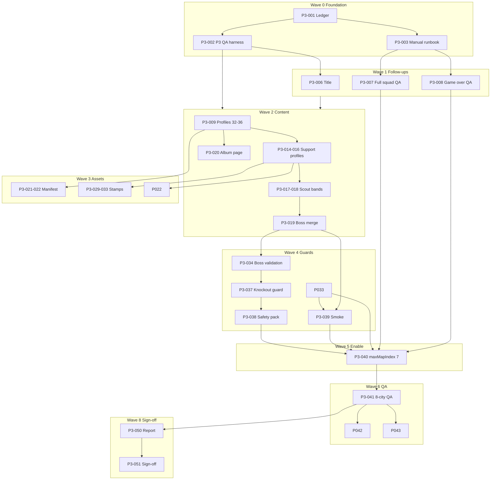

# SPEC 013 — Phase 3 Expansion, Content Completion, and Release Hardening Plan

**Status:** Proposed Phase 3 implementation plan  
**Authority:** Follows Phase 2 sign-off in [019 — Phase 2 Validation Report](./019-phase-2-validation-report.md) and executes deferred work from [015 — Phase 2 Execution Plan](./015-phase-2-engineering-task-breakdown.md) (P2-028)  
**Inputs:** [006B](./006B-technical-blueprint-revised.md), [007](./007-football-data-pack.md), [008](./008-meta-progression.md), [009](./009-gameplay-loop-node-system.md), [016](./016-phase-2-bridge-inventory.md), [017](./017-phase-2-manual-qa-runbook.md), [018](./018-portrait-asset-strategy.md), [020](./020-phase-2-assumptions-tradeoffs-assets-report.html)  
**Version:** v0.1  
**Date:** 2026-06-10  
**Execution model:** One atomic task per commit. Keep the game playable after every task. No automated screenshots unless explicitly requested.  
**Companion (created in P3-001):** `022-phase-3-engineering-task-breakdown.md` — live task ledger

---

## 1. Executive Summary

Phase 1 and Phase 2 delivered a polished, release-safe **3-city vertical slice**. Automated validation is green, HTTP smoke passes, manual QA is **PASS WITH FOLLOW-UP**, and expansion JSON contracts exist in **prepare-only** mode with `FEATURES.maxMapIndex` locked at `2`.

Phase 3 expands the playable campaign from **3 to 8 Host City Challenges** without introducing knockout, legends meta, economy, cloud save, or battle math changes. The work sequence is deliberate:

1. Establish Phase 3 validation, manual QA, and execution ledgers.
2. Close non-blocking Phase 2 follow-ups (document title, full-squad QA, game-over settlement QA).
3. Complete missing catalog content — especially **profiles 32–36** and boss roster dependencies from SPEC 007.
4. Replace expansion stub rosters with final federation teams and merge expansion data into runtime catalogs.
5. Ship owned stamp assets and portrait manifest entries for maps 3–7.
6. Harden runtime guards so knockout cannot accidentally start before Phase 4.
7. Enable `FEATURES.maxMapIndex = 7` only after content, assets, guards, and QA gates are green.
8. Run full 8-city manual QA, fix blockers atomically, and sign off.

**Default recommendation:** Treat map enablement (P3-040) as a single explicit gate commit that runs only after Waves 0–5 exit criteria pass. Do not flip `maxMapIndex` while authoring content or assets in the same commit.

---

## 2. Phase 3 Goals

- Expand playable host-city runtime from maps **0–2** to **0–7** (8 City Stamps).
- Author and load **profiles 32–36** (Figo, Rossi, Bergkamp, Sánchez, Charlton) plus roster-support profiles required by SPEC 007 §7.1.
- Replace `host_city_expansion.json` stub rosters with **final federation boss teams** merged into `host_city_bosses.json`.
- Merge `scout_pools_expansion.json` late/finale bands into runtime scout pools.
- Add **Host City Heroes** album page (maps 0–7 anchors) without enabling knockout/legends pages.
- Create or connect **stamp SVG assets** for Madrid, Milan, Amsterdam, Mexico City, and London.
- Extend portrait manifest coverage for all newly playable profile IDs (T0 jersey fallbacks acceptable).
- Add Phase 3 QA harness, 8-city manual runbook, and validation report.
- Close Phase 2 follow-ups: document `<title>`, full-squad replacement QA, game-over settlement QA.
- Preserve release-safety invariants: **no cloud save**, **no live API runtime**, **no battle math changes**, **save schema v3 only**.

---

## 3. Non-Goals

- **No knockout stage** (maps 8+, `eliteIndex`, gate teams) — deferred to Phase 4.
- **No legends nodes**, legend fragments, or legends album page unlock — Phase 4.
- **No Football Credits economy**, achievement rewards, or meta shop — Phase 4.
- **No cloud save reactivation** — requires separate formal decision and merge policy (008 §17).
- **No battle math / `STYLE_CHART` / `TYPE_CHART` changes** unless an explicitly scoped combat task is approved.
- **No TheSportsDB or PokeAPI** in public-critical runtime paths.
- **No React/Next migration** — runtime stays vanilla JS; domain modules remain portable.
- **No wholesale bridge deletion** via search-and-replace (`catch-screen`, `badge-screen`, `speciesId`, `poke_dex`).
- **No combined mega-commits** mixing content authoring, UI polish, save/account work, and `maxMapIndex` enablement.
- **No T2/T3 likeness portraits** without product/legal sign-off (018 decision stands: T0/T1 only for Phase 3).

---

## 4. Current Baseline from Phase 2

| Area | State | Evidence |
|------|-------|----------|
| Playable slice | Maps 0–2, 3 stamps → Slice Complete → Settlement Lite | `FEATURES.maxMapIndex: 2` |
| Phase 2 tasks | 30/30 complete | [015](./015-phase-2-engineering-task-breakdown.md) |
| Automated validation | Green | `rtk npm run validate` — domain + P1 QA + P2 QA + docs + syntax |
| HTTP smoke | Green | `rtk npm run smoke:http` — boot, JSON, expansion guard files, stamp assets |
| Manual QA | PASS WITH FOLLOW-UP | [017](./017-phase-2-manual-qa-runbook.md) Attempt 2 |
| Player catalog | **20 profiles** in `player_profiles.json` | IDs: 1–4, 6–7, 9–10, 12, 14–18, 22, 26, 28–31 |
| Host city bosses (runtime) | **3 bosses** maps 0–2 | `host_city_bosses.json` |
| Host city bosses (prepare) | **5 stub bosses** maps 3–7 | `host_city_expansion.json` (`contentStatus: expansion_stub`) |
| Scout pools (runtime) | early + mid bands (maps 0–2) | `scout_pools.json` |
| Scout pools (prepare) | late + finale bands (maps 3–7) | `scout_pools_expansion.json` (not loaded) |
| Album layout (runtime) | marquee + favorites | `album_layout.json` |
| Album layout (prepare) | host_city, knockout, legends stubs | `album_layout_expansion.json` (not merged) |
| Stamp assets | São Paulo, Berlin, Tokyo | `assets/stamps/*.svg` |
| Portrait manifest | 20 entries, T0 jersey fallbacks | `portrait_manifest.json` |
| Cloud save | Disabled and validated inert | `FEATURES.cloudSave: false` |
| Settlement dedupe | Local guard active | `football_last_settled_run_id` |

**Phase 2 verdict:** **GO** for 3-city slice · **NO-GO** for maps 3–7 until Phase 3 gates pass.

---

## 5. Phase 2 Follow-Ups Carried Forward

| Follow-up | Source | Phase 3 task | Blocking? |
|-----------|--------|--------------|-----------|
| Document `<title>` still `Pokemon Roguelike` | P2-022 Attempt 2 | P3-006 | No — polish/legal clarity |
| Full six-slot Squad Registration not manually exercised end-to-end | P2-022 | P3-007 | No — but required before external demo |
| Game-over settlement not manually replayed in browser | P2-022 | P3-008 | No — harness covers order; manual confirms UX |
| Hidden legacy Classic headings remain in DOM | P2-022 | P3-009 (optional) | No — keep unless product requests removal |
| Expansion boss rosters are placeholders | P2-024/P2-028 | P3-019 | **Yes** for map enablement |
| Profiles 32–36 missing from catalog | 019 §7 | P3-009–P3-013 | **Yes** for map enablement |
| Stamp art for maps 3–7 missing | 019 §7 | P3-029–P3-033 | **Yes** for map enablement |
| `FEATURES.maxMapIndex` enable deferred | P2-028 | P3-040 | **Yes** — explicit gate only |

---

## 6. Expansion Readiness Assessment

### 6.1 Ready now

| Artifact | Readiness | Notes |
|----------|-----------|-------|
| Map generator topology | ✅ | `generateMap(mapIndex)` supports 0–7 unchanged |
| `DomainBosses` loader + validation framework | ✅ | Slice count guard must be relaxed in dedicated task |
| Expansion JSON schemas | ✅ | Validate offline; smoke HTTP fetches them |
| City Stamp ceremony + stamp asset hook | ✅ | `getFootballStampAsset()` pattern from P2-015 |
| Scout report / contract / squad flows | ✅ | Map-agnostic; pool bands need merge |
| Slice-complete routing | ✅ | `getFootballSliceStampTarget()` = `maxMapIndex + 1` — becomes 8 when cap is 7 |
| No-live-API + portrait manifest pipeline | ✅ | Extend entries per new profile |
| Settlement lite + dedupe | ✅ | No schema change required for 8-city |

### 6.2 Not ready — must complete in Phase 3

| Gap | Risk if enabled early | Owner lane |
|-----|----------------------|------------|
| Profiles 32–36 absent | Boss battles reference missing catalog entries → boot/runtime failure | Content |
| Boss roster support IDs missing (13, 19, 21, 23–25, 27, 40) | `DomainBosses.buildBossTeam()` throws | Content |
| Stub rosters in expansion JSON | Wrong fantasy, wrong difficulty, wrong album exposure | Content |
| Scout late/finale bands not in runtime loader | Empty or wrong pools on maps 3–7 | Content |
| `host_city_bosses.json` still 3 entries | Maps 3–7 unreachable even if cap raised | Content |
| Stamp SVGs missing for 5 cities | Ceremony falls back to flag emoji only | Assets |
| `validate-football-domain.mjs` enforces 3-boss slice | CI fails on 8-boss catalog | Validation |
| Knockout path after map 7 | `startMap(8)` exists in `game.js` | Runtime guard needed before enable |

### 6.3 Readiness scorecard

| Gate | Prerequisite tasks | Exit signal |
|------|-------------------|-------------|
| **Content gate** | P3-009–P3-020 | All boss roster `profileId`s resolve in catalog; 8 contiguous bosses validate |
| **Asset gate** | P3-021–P3-022, P3-029–P3-033 | Portrait manifest complete for playable IDs; 8 stamp assets exist |
| **Guard gate** | P3-034–P3-039 | Validation accepts 8-boss mode; knockout blocked post-stamp-8 |
| **QA gate** | P3-007–P3-008, P3-041 | Manual 8-city PASS; follow-ups closed |
| **Enable gate** | P3-040 | Single commit flips `maxMapIndex` to `7` |

---

## 7. Required Content Gaps

### 7.1 Host city hero profiles (critical)

| profileId | Player | mapIndex | hostCity | In catalog? |
|-----------|--------|----------|----------|-------------|
| 32 | Luís Figo | 3 | Madrid | ❌ |
| 33 | Paolo Rossi | 4 | Milan | ❌ |
| 34 | Dennis Bergkamp | 5 | Amsterdam | ❌ |
| 35 | Hugo Sánchez | 6 | Mexico City | ❌ |
| 36 | Bobby Charlton | 7 | London | ❌ |

Stats, styles, rarity, and album metadata per [007 §3.3 and §4.2](./007-football-data-pack.md).

### 7.2 Boss roster support profiles (required by 007 §7.1)

| profileId | Player | Used in map | In catalog? |
|-----------|--------|-------------|-------------|
| 13 | Harry Kane | 7 | ❌ |
| 19 | Andrés Iniesta | 3 | ❌ |
| 21 | Roberto Carlos | 3 | ❌ |
| 23 | Paolo Maldini | 4 | ❌ |
| 24 | Gianluigi Buffon | 4 | ❌ |
| 25 | Iker Casillas | 7 | ❌ |
| 27 | Johan Cruyff | 5 | ❌ |
| 40 | Lilian Thuram | 5 (Van Dijk starter fallback) | ❌ |

**Phase 3 minimum:** These eight IDs plus 32–36 (13 new profiles). Full 50-player catalog is **not** required for 8-city runtime but remains a Phase 4+ content goal.

### 7.3 Data merge gaps

| File | Current | Phase 3 target |
|------|---------|----------------|
| `host_city_bosses.json` | 3 bosses, final rosters | 8 bosses, 007 §7.1 rosters for maps 3–7 |
| `scout_pools.json` | early + mid | + late (maps 3–5) + finale (maps 6–7) bands |
| `album_layout.json` | marquee + favorites | + `host_city` page with slots 29–36 |
| `host_city_expansion.json` | stub | Keep as archive or mark `merged` after P3-019 |
| `scout_pools_expansion.json` | stub | Keep as archive after merge |
| `album_layout_expansion.json` | stub | knockout/legends pages stay deferred |

### 7.4 Scout pool alignment (007 §6.2)

Late maps should expose mid/elite depth per 007 weight tables — not only the 20-profile slice subset. After merge, validate that maps 3–7 pools only reference **existing catalog IDs**.

---

## 8. Required Asset Gaps

| Asset | Maps | Status | Phase 3 action |
|-------|------|--------|----------------|
| `sao-paulo-stamp.svg` | 0 | ✅ | None |
| `berlin-stamp.svg` | 1 | ✅ | None |
| `tokyo-stamp.svg` | 2 | ✅ | None |
| `madrid-stamp.svg` | 3 | ❌ | P3-029 |
| `milan-stamp.svg` | 4 | ❌ | P3-030 |
| `amsterdam-stamp.svg` | 5 | ❌ | P3-031 |
| `mexico-city-stamp.svg` | 6 | ❌ | P3-032 |
| `london-stamp.svg` | 7 | ❌ | P3-033 |
| Portrait manifest entries | 32–36 + support IDs | ❌ partial | P3-021, P3-022 |
| T1 stylized avatars | All | ❌ | **Defer** — T0 acceptable per 018 |

**Art constraints:** Abstract stamp graphics, nation colors, host city labels — no protected federation logos or likenesses without approval.

---

## 9. Bridges Still Open from Phase 2

From [016 — Phase 2 Bridge Inventory](./016-phase-2-bridge-inventory.md):

| Bridge | Classification | Phase 3 direction |
|--------|----------------|-------------------|
| `speciesId` as `profileId` | Keep | No change unless save v4 task approved |
| `getPokedex()` read compatibility | Keep | No football UI usage |
| `poke_dex` localStorage key | Keep | Migration fallback only |
| `catch-screen` / `swap-screen` IDs | Reduced | Do not rename handlers in Phase 3 |
| `badge-screen` / `badge-*` selectors | Reduced | Stamp assets only; keep IDs |
| `TYPE_CHART` / style projection | Keep | Out of scope |
| `GYM_LEADERS` | Keep | Non-football branches |
| TheSportsDB shortcut | Retired from runtime | Re-validate in P3-038 |
| Cloud save module | Keep inert | Explicitly off |
| Document title `Pokemon Roguelike` | Open | P3-006 |

**Rule:** Bridge retirement in Phase 3 is **documentation + grep gates only** unless a task proves zero regression risk. No mass rename.

---

## 10. Release-Safety Constraints

These invariants must hold after **every** Phase 3 commit:

| Policy | Enforcement |
|--------|-------------|
| `FEATURES.cloudSave === false` | P3-002 harness + P3-038 regression |
| `FEATURES.useTheSportsDbPortraits === false` | P3-038 no-live-API gate |
| No runtime fetch to TheSportsDB/PokeAPI on boot or gameplay hot path | `validate-phase3-qa.mjs` |
| `SAVE_SCHEMA_VERSION === 3` | Stop if migration needed |
| Battle math unchanged | `validate-phase1-qa.mjs` P1-050 continuity |
| `maxMapIndex === 2` until P3-040 | P3-002, P3-034–P3-039 assert cap |
| Game playable after each commit | 3-city path must not regress until P3-040 |
| Knockout not reachable in football mode | P3-037 guard |
| Settlement patch-before-clear order preserved | P1-048 + P3-008 manual |

---

## 11. Proposed Execution Waves

| Wave | Goal | Tasks | Parallelizable? | Exit gate |
|------|------|-------|-----------------|-----------|
| **Wave 0** | Planning and validation foundation | P3-001–P3-005 | P3-003 beside P3-002 after P3-001 | Ledger, P3 QA harness, 8-city runbook exist |
| **Wave 1** | Phase 2 follow-up closure | P3-006–P3-008 | P3-006 parallel with P3-007 prep | Follow-ups recorded PASS |
| **Wave 2** | Expansion content completion | P3-009–P3-020 | Profiles parallel across lanes if files staged | 8-boss catalog validates offline with full profile refs |
| **Wave 3** | Expansion asset completion | P3-021–P3-022, P3-029–P3-033 | Stamps parallel after P3-014 | 8 stamps + manifest coverage |
| **Wave 4** | Runtime expansion guards | P3-034–P3-039 | Sequential — shared validation files | 8-boss mode validates with `maxMapIndex` still 2 |
| **Wave 5** | Enable maps 3–7 | **P3-040 only** | None | `maxMapIndex: 7`; 3-city regression + 8-city boot |
| **Wave 6** | Full 8-city manual QA | P3-041–P3-042 | P3-043 per blocker | Manual PASS recorded |
| **Wave 7** | Bugfix buffer | P3-044+ as needed | One bug per commit | No blockers |
| **Wave 8** | Phase 3 sign-off | P3-050–P3-051 | Sequential | Validation report + GO/NO-GO |

---

## 12. Parallel Work Lanes

| Lane | Ownership | Typical files | Tasks |
|------|-----------|---------------|-------|
| **A — Validation & Process** | Harnesses, docs, smoke, ledgers | `package.json`, `scripts/*`, `docs/021*`, `docs/022*`, `docs/023*` | P3-001–P3-005, P3-041–P3-051 |
| **B — Content / Catalog** | Profiles, bosses, scouts, album JSON | `data/football/*`, validation scripts | P3-009–P3-020 |
| **C — Assets** | Stamps, portrait manifest | `assets/stamps/*`, `portrait_manifest.json`, `js/domain/profiles.js` | P3-021–P3-022, P3-029–P3-033 |
| **D — Runtime Guards** | Features, game flow, domain loaders | `js/domain/*`, `js/game.js`, validation scripts | P3-034–P3-040 |
| **E — UX / Copy** | Title, completion screens | `index.html`, `js/ui.js`, `js/domain/theme.js` | P3-006, P3-035–P3-036 |

**Conflict rule:** Do not run Lane D enable tasks while Lane B is mid-merge on `host_city_bosses.json`. Lane C stamp tasks can parallel Lane B after profile IDs are frozen.

---

## 13. Full Task Breakdown

### Operating principle

Same loop as Phase 2:

```text
1. Pre-flight — dependency, files, stop condition
2. Implementation — smallest scoped change
3. Validation — task-specific + rtk npm run validate
4. Manual QA — when listed
5. Docs — update 022 ledger, 024 assumptions HTML, 013 frictions if visual debt found
6. Commit — atomic with evidence in message
```

---

### Wave 0 — Planning and validation foundation

#### P3-001

**Title:** Create Phase 3 task ledger and validation protocol  
**Objective:** Establish `022-phase-3-engineering-task-breakdown.md` with status registry, DoD, waves, and commit template.  
**Files likely touched:** `docs/021-phase-3-expansion-content-release-hardening-plan.md`, `docs/022-phase-3-engineering-task-breakdown.md`, `scripts/validate-docs.mjs`  
**Dependencies:** Phase 2 sign-off (P2-030).  
**Implementation notes:** Mirror 015 structure. Link SPEC 013 ↔ 022. Add docs validation for P3 task ID presence.  
**Acceptance criteria:** Ledger exists; `npm run validate` docs check passes.  
**Validation command:** `rtk npm run validate`  
**Manual QA step:** N/A  
**Risk level:** Low  
**Stop condition:** Stop if docs validation cannot reference P3 IDs without brittle checks.

#### P3-002

**Title:** Add Phase 3 QA harness shell  
**Objective:** Create `scripts/validate-phase3-qa.mjs` wired into `npm run validate`.  
**Files likely touched:** `package.json`, `scripts/validate-phase3-qa.mjs`, `scripts/validate-docs.mjs`  
**Dependencies:** P3-001  
**Implementation notes:** Initial checks: SPEC 013/022 present, P2 harness still runs, `maxMapIndex: 2`, `cloudSave: false`, expansion JSON still fetchable.  
**Acceptance criteria:** Validate fails clearly on P3 gate violations; no runtime behavior change.  
**Validation command:** `rtk npm run validate`  
**Manual QA step:** N/A  
**Risk level:** Low  
**Stop condition:** Stop if P3 harness obscures P1/P2 failures.

#### P3-003

**Title:** Add Phase 3 manual QA runbook (8-city path)  
**Objective:** Create `docs/023-phase-3-manual-qa-runbook.md` extending 017 for full 8-stamp campaign.  
**Files likely touched:** `docs/023-phase-3-manual-qa-runbook.md`, `docs/022-phase-3-engineering-task-breakdown.md`  
**Dependencies:** P3-001  
**Implementation notes:** Include per-map boss spot checks, stamp asset verification, album host_city page, knockout must-not-start assertion, reload mid-map 4+, settlement after stamp 8.  
**Acceptance criteria:** Tester can execute without codebase knowledge.  
**Validation command:** `rtk npm run validate`  
**Manual QA step:** N/A  
**Risk level:** Low  
**Stop condition:** Stop if steps require undisclosed dev cheats for loss testing.

#### P3-004

**Title:** Phase 3 assumptions and asset gaps companion  
**Objective:** Create `024-phase-3-assumptions-tradeoffs-assets-report.html` for expansion decisions.  
**Files likely touched:** `docs/024-phase-3-assumptions-tradeoffs-assets-report.html`, `docs/022-phase-3-engineering-task-breakdown.md`  
**Dependencies:** P3-001  
**Implementation notes:** Record content gaps, stamp art ownership, knockout deferral, cloud save deferral, portrait tier stance.  
**Acceptance criteria:** HTML documents all §7–§8 gaps with owners.  
**Validation command:** `rtk npm run validate`  
**Manual QA step:** N/A  
**Risk level:** Low  
**Stop condition:** N/A

#### P3-005

**Title:** Refresh bridge inventory for Phase 3 scope  
**Objective:** Update `016-phase-2-bridge-inventory.md` with Phase 3 bridge policy (keep vs defer).  
**Files likely touched:** `docs/016-phase-2-bridge-inventory.md`, `scripts/validate-phase3-qa.mjs`  
**Dependencies:** P3-002  
**Implementation notes:** Document that Phase 3 does not authorize `speciesId` rename or catch-screen ID removal.  
**Acceptance criteria:** Inventory lists Phase 3 touch/no-touch bridges.  
**Validation command:** `rtk npm run validate`  
**Manual QA step:** N/A  
**Risk level:** Low  
**Stop condition:** N/A

---

### Wave 1 — Phase 2 follow-up QA closure

#### P3-006

**Title:** Update document title for football campaign  
**Objective:** Replace `Pokemon Roguelike` in `<title>` with football-facing product string.  
**Files likely touched:** `index.html`, `js/domain/theme.js` (if title constants exist), `scripts/validate-phase3-qa.mjs`  
**Dependencies:** P3-002  
**Implementation notes:** **Decision gate:** confirm exact title with product (e.g. `World Cup: Road to Glory` or `Pokelike — Road to Glory`). Do not change Classic-only hidden headings in this task.  
**Acceptance criteria:** Browser tab title is football-facing; 3-city playable path unchanged.  
**Validation command:** `rtk npm run validate` + `rtk npm run smoke:http`  
**Manual QA step:** Boot app; confirm tab title.  
**Risk level:** Low (product copy)  
**Stop condition:** Stop without approved title string.

#### P3-007

**Title:** Manual QA — full-squad replacement loop  
**Objective:** Execute and record §5 Full-Squad QA from 017; close FOLLOW-UP.  
**Files likely touched:** `docs/017-phase-2-manual-qa-runbook.md`, `docs/023-phase-3-manual-qa-runbook.md`, `docs/022-phase-3-engineering-task-breakdown.md`  
**Dependencies:** P3-003, P3-006 optional  
**Implementation notes:** Record attempt in both 017 (closure) and 023. No code unless blocker found → spawn P3-044+.  
**Acceptance criteria:** Full-squad sign/decline/replace PASS recorded.  
**Validation command:** `rtk npm run validate`  
**Manual QA step:** Runbook §5 all steps PASS.  
**Risk level:** Medium  
**Stop condition:** If blocker found, stop enablement work; fix via Wave 7.

#### P3-008

**Title:** Manual QA — game-over settlement path  
**Objective:** Execute and record §7 Game-Over QA from 017; close FOLLOW-UP.  
**Files likely touched:** `docs/017-phase-2-manual-qa-runbook.md`, `docs/023-phase-3-manual-qa-runbook.md`  
**Dependencies:** P3-003  
**Implementation notes:** Loss via normal play preferred. No committed dev-only loss shortcuts.  
**Acceptance criteria:** Game-over → Settlement Lite → title → album persistence PASS.  
**Validation command:** `rtk npm run validate`  
**Manual QA step:** Runbook §7 all steps PASS.  
**Risk level:** Medium  
**Stop condition:** Blocker → Wave 7 fix before P3-040.

---

### Wave 2 — Expansion content completion

#### P3-009

**Title:** Add profile 32 — Luís Figo  
**Objective:** Author catalog entry per 007 §3.3/§4.2 for Madrid host city hero.  
**Files likely touched:** `data/football/player_profiles.json`, `scripts/validate-football-domain.mjs`  
**Dependencies:** P3-002  
**Implementation notes:** `albumPage: host_city`, `scoutable: true`, stats from 007 table. No portrait file required (manifest task later).  
**Acceptance criteria:** `DomainProfiles.getProfile(32)` resolves; domain validation passes.  
**Validation command:** `rtk npm run validate`  
**Manual QA step:** N/A  
**Risk level:** Low  
**Stop condition:** Stop if stats require battle tuning task.

#### P3-010

**Title:** Add profile 33 — Paolo Rossi  
**Objective:** Author Milan host city hero catalog entry.  
**Files likely touched:** `data/football/player_profiles.json`, `scripts/validate-football-domain.mjs`  
**Dependencies:** P3-009  
**Implementation notes:** Rare tier, clinical_finishing primary.  
**Acceptance criteria:** Profile 33 loads and validates.  
**Validation command:** `rtk npm run validate`  
**Manual QA step:** N/A  
**Risk level:** Low  
**Stop condition:** Same as P3-009.

#### P3-011

**Title:** Add profile 34 — Dennis Bergkamp  
**Objective:** Author Amsterdam host city hero catalog entry.  
**Files likely touched:** `data/football/player_profiles.json`  
**Dependencies:** P3-010  
**Acceptance criteria:** Profile 34 validates.  
**Validation command:** `rtk npm run validate`  
**Manual QA step:** N/A  
**Risk level:** Low  
**Stop condition:** Same as P3-009.

#### P3-012

**Title:** Add profile 35 — Hugo Sánchez  
**Objective:** Author Mexico City host city hero catalog entry.  
**Files likely touched:** `data/football/player_profiles.json`  
**Dependencies:** P3-011  
**Acceptance criteria:** Profile 35 validates.  
**Validation command:** `rtk npm run validate`  
**Manual QA step:** N/A  
**Risk level:** Low  
**Stop condition:** Same as P3-009.

#### P3-013

**Title:** Add profile 36 — Bobby Charlton  
**Objective:** Author London host city hero catalog entry.  
**Files likely touched:** `data/football/player_profiles.json`  
**Dependencies:** P3-012  
**Acceptance criteria:** Profile 36 validates.  
**Validation command:** `rtk npm run validate`  
**Manual QA step:** N/A  
**Risk level:** Low  
**Stop condition:** Same as P3-009.

#### P3-014

**Title:** Add boss roster support profiles batch A (13, 19, 21)  
**Objective:** Author Kane, Iniesta, Roberto Carlos for maps 3 and 7 rosters.  
**Files likely touched:** `data/football/player_profiles.json`  
**Dependencies:** P3-013  
**Implementation notes:** One commit adding three profiles is acceptable if validation is single gate; alternatively split 13/19/21 if review prefers — default: **one commit** for batch A.  
**Acceptance criteria:** Profiles 13, 19, 21 resolve.  
**Validation command:** `rtk npm run validate`  
**Manual QA step:** N/A  
**Risk level:** Low  
**Stop condition:** N/A

#### P3-015

**Title:** Add boss roster support profiles batch B (23, 24, 25)  
**Objective:** Author Maldini, Buffon, Casillas for map 4 and 7.  
**Files likely touched:** `data/football/player_profiles.json`  
**Dependencies:** P3-014  
**Acceptance criteria:** Profiles 23, 24, 25 resolve.  
**Validation command:** `rtk npm run validate`  
**Manual QA step:** N/A  
**Risk level:** Low  
**Stop condition:** N/A

#### P3-016

**Title:** Add boss roster support profiles batch C (27, 40)  
**Objective:** Author Cruyff and Thuram for map 5 roster / Van Dijk fallback.  
**Files likely touched:** `data/football/player_profiles.json`  
**Dependencies:** P3-015  
**Implementation notes:** Document Thuram substitution rule in boss JSON comments when starter is profile 3.  
**Acceptance criteria:** Profiles 27, 40 resolve.  
**Validation command:** `rtk npm run validate`  
**Manual QA step:** N/A  
**Risk level:** Low  
**Stop condition:** N/A

#### P3-017

**Title:** Merge late scout band into runtime scout pools  
**Objective:** Add maps 3–5 band from expansion into `scout_pools.json`.  
**Files likely touched:** `data/football/scout_pools.json`, `scripts/validate-football-domain.mjs`  
**Dependencies:** P3-016  
**Implementation notes:** Filter `profileIds` to catalog IDs that exist post-P3-016. Adjust weights per 007 §6.2 mid/late tables.  
**Acceptance criteria:** `DomainScout` builds reports for mapIndex 3–5 in validation fixture.  
**Validation command:** `rtk npm run validate`  
**Manual QA step:** N/A  
**Risk level:** Medium  
**Stop condition:** Stop if pool references missing profileId.

#### P3-018

**Title:** Merge finale scout band into runtime scout pools  
**Objective:** Add maps 6–7 band into `scout_pools.json`.  
**Files likely touched:** `data/football/scout_pools.json`  
**Dependencies:** P3-017  
**Acceptance criteria:** Map 6–7 scout validation passes.  
**Validation command:** `rtk npm run validate`  
**Manual QA step:** N/A  
**Risk level:** Medium  
**Stop condition:** Same as P3-017.

#### P3-019

**Title:** Merge final boss rosters for maps 3–7 into host_city_bosses.json  
**Objective:** Replace expansion stubs with 007 §7.1 rosters; append maps 3–7 to runtime boss catalog.  
**Files likely touched:** `data/football/host_city_bosses.json`, `data/football/host_city_expansion.json` (status note), `scripts/validate-football-domain.mjs`  
**Dependencies:** P3-016  
**Implementation notes:** Include Van Dijk→Thuram conditional note for map 5 in `balance.notes`. Keep `maxMapIndex: 2` — validation uses opt-in `expectedMapSpan: 7` flag in P3-034.  
**Acceptance criteria:** 8 boss entries validate offline; all roster profileIds in catalog.  
**Validation command:** `rtk npm run validate` (slice mode may still expect 3 until P3-034)  
**Manual QA step:** N/A  
**Risk level:** High  
**Stop condition:** Stop if catalog missing any roster ID.

#### P3-020

**Title:** Add Host City Heroes album page  
**Objective:** Merge `host_city` page with slots for profiles 29–36 into `album_layout.json`.  
**Files likely touched:** `data/football/album_layout.json`, `js/domain/album.js`, `scripts/validate-football-domain.mjs`  
**Dependencies:** P3-013  
**Implementation notes:** Do not merge knockout/legends pages. Remove `host_city` from `deferredPages`.  
**Acceptance criteria:** Album layout validates; page hidden until profiles seen/signed through play.  
**Validation command:** `rtk npm run validate`  
**Manual QA step:** N/A  
**Risk level:** Medium  
**Stop condition:** Stop if album semantics require save migration.

---

### Wave 3 — Expansion asset completion

#### P3-021

**Title:** Portrait manifest entries for profiles 32–36  
**Objective:** Add T0 fallback entries for new host city heroes.  
**Files likely touched:** `data/football/portrait_manifest.json`, `scripts/validate-football-domain.mjs`  
**Dependencies:** P3-013, P3-009  
**Acceptance criteria:** Manifest covers 32–36; no-live-API check passes.  
**Validation command:** `rtk npm run validate`  
**Manual QA step:** N/A  
**Risk level:** Low  
**Stop condition:** Stop if T2/T3 assets requested without approval.

#### P3-022

**Title:** Portrait manifest entries for expansion support profiles  
**Objective:** Add T0 entries for IDs 13, 19, 21, 23–25, 27, 40.  
**Files likely touched:** `data/football/portrait_manifest.json`  
**Dependencies:** P3-016, P3-021  
**Acceptance criteria:** All catalog IDs used in maps 0–7 bosses/scouts have manifest entries.  
**Validation command:** `rtk npm run validate`  
**Manual QA step:** N/A  
**Risk level:** Low  
**Stop condition:** N/A

#### P3-029

**Title:** Madrid City Stamp SVG asset  
**Objective:** Add owned stamp asset and wire stamp id `stamp_madrid`.  
**Files likely touched:** `assets/stamps/madrid-stamp.svg`, `js/game.js` or stamp registry, `scripts/smoke-http.mjs`  
**Dependencies:** P3-014  
**Implementation notes:** Match visual language of existing three stamps. No FIFA/RFEF logos.  
**Acceptance criteria:** Asset loads via HTTP smoke; ceremony resolves asset when boss stub tested in isolation.  
**Validation command:** `rtk npm run validate` + `rtk npm run smoke:http`  
**Manual QA step:** N/A until map 3 enabled  
**Risk level:** Medium  
**Stop condition:** **Decision gate** if art ownership unclear.

#### P3-030

**Title:** Milan City Stamp SVG asset  
**Objective:** Add `stamp_milan` asset.  
**Files likely touched:** `assets/stamps/milan-stamp.svg`, smoke script  
**Dependencies:** P3-029  
**Acceptance criteria:** Smoke fetches asset.  
**Validation command:** `rtk npm run validate` + `rtk npm run smoke:http`  
**Manual QA step:** N/A  
**Risk level:** Medium  
**Stop condition:** Same as P3-029.

#### P3-031

**Title:** Amsterdam City Stamp SVG asset  
**Objective:** Add `stamp_amsterdam` asset.  
**Files likely touched:** `assets/stamps/amsterdam-stamp.svg`  
**Dependencies:** P3-030  
**Acceptance criteria:** Smoke passes.  
**Validation command:** `rtk npm run validate` + `rtk npm run smoke:http`  
**Manual QA step:** N/A  
**Risk level:** Medium  
**Stop condition:** Same as P3-029.

#### P3-032

**Title:** Mexico City City Stamp SVG asset  
**Objective:** Add `stamp_mexico_city` asset.  
**Files likely touched:** `assets/stamps/mexico-city-stamp.svg`  
**Dependencies:** P3-031  
**Acceptance criteria:** Smoke passes.  
**Validation command:** `rtk npm run validate` + `rtk npm run smoke:http`  
**Manual QA step:** N/A  
**Risk level:** Medium  
**Stop condition:** Same as P3-029.

#### P3-033

**Title:** London City Stamp SVG asset  
**Objective:** Add `stamp_london` asset.  
**Files likely touched:** `assets/stamps/london-stamp.svg`  
**Dependencies:** P3-032  
**Acceptance criteria:** All 8 stamp paths in smoke HTTP checklist.  
**Validation command:** `rtk npm run validate` + `rtk npm run smoke:http`  
**Manual QA step:** N/A  
**Risk level:** Medium  
**Stop condition:** Same as P3-029.

---

### Wave 4 — Runtime expansion guards

#### P3-034

**Title:** DomainBosses validation mode for 8-host-city catalog  
**Objective:** Allow validating 8 contiguous bosses while runtime cap remains 2.  
**Files likely touched:** `js/domain/bosses.js`, `scripts/validate-football-domain.mjs`, `scripts/validate-phase3-qa.mjs`  
**Dependencies:** P3-019  
**Implementation notes:** Replace hardcoded `bosses.length !== 3` with `enforceSliceCount` + `expectedMapSpan` options. Runtime loader still filters by `maxMapIndex`.  
**Acceptance criteria:** CI validates full 8-boss JSON; runtime still exposes only 3.  
**Validation command:** `rtk npm run validate`  
**Manual QA step:** N/A  
**Risk level:** Medium  
**Stop condition:** Stop if runtime accidentally loads map 3+ before P3-040.

#### P3-035

**Title:** Eight-stamp completion screen copy update  
**Objective:** Update Slice Complete strings for 8-stamp campaign end (still routes to Settlement Lite).  
**Files likely touched:** `js/game.js`, `js/domain/theme.js`, `js/ui.js`  
**Dependencies:** P3-034  
**Implementation notes:** Copy should say eight Host City Challenges when `maxMapIndex === 7`. Keep screen ID `slice-complete-screen` for bridge compatibility.  
**Acceptance criteria:** With cap still 2, copy unchanged for 3-stamp path; fixture test for 8-stamp strings behind flag.  
**Validation command:** `rtk npm run validate`  
**Manual QA step:** N/A  
**Risk level:** Low  
**Stop condition:** N/A

#### P3-036

**Title:** Album progress for host_city page in completion summary  
**Objective:** Include host city page signed count in completion/settlement summary.  
**Files likely touched:** `js/ui.js`, `js/domain/album.js`  
**Dependencies:** P3-020, P3-035  
**Implementation notes:** Presentation only — no save semantics change.  
**Acceptance criteria:** Summary math uses new page slots.  
**Validation command:** `rtk npm run validate`  
**Manual QA step:** N/A  
**Risk level:** Low  
**Stop condition:** Stop if requires account economy fields.

#### P3-037

**Title:** Knockout entry guard for football 8-city terminus  
**Objective:** Prevent `startMap(8)` / knockout when knockout not in scope.  
**Files likely touched:** `js/game.js`, `js/domain/features.js`, `scripts/validate-phase3-qa.mjs`  
**Dependencies:** P3-035  
**Implementation notes:** After stamp 8, `isFootballSliceComplete()` should fire before knockout branch. Add explicit `FEATURES.knockoutEnabled: false` guard on map 8 transition.  
**Acceptance criteria:** Validation proves football mode cannot enter knockout pre-Phase 4.  
**Validation command:** `rtk npm run validate`  
**Manual QA step:** N/A  
**Risk level:** High  
**Stop condition:** Stop if guard breaks 3-city slice completion.

#### P3-038

**Title:** Phase 3 release-safety regression pack  
**Objective:** Extend P3 QA harness: cloud off, no-live-API, battle math, settlement order.  
**Files likely touched:** `scripts/validate-phase3-qa.mjs`, `scripts/validate-phase2-qa.mjs`  
**Dependencies:** P3-002, P3-037  
**Acceptance criteria:** All release-safety rows in §10 covered by automated checks.  
**Validation command:** `rtk npm run validate`  
**Manual QA step:** N/A  
**Risk level:** Low  
**Stop condition:** N/A

#### P3-039

**Title:** HTTP smoke expansion readiness checklist  
**Objective:** Add smoke routes for new stamps, 8-boss JSON size, new profiles manifest coverage.  
**Files likely touched:** `scripts/smoke-http.mjs`, `scripts/validate-phase3-qa.mjs`  
**Dependencies:** P3-033, P3-019, P3-022  
**Acceptance criteria:** `rtk npm run smoke:http` verifies all Phase 3 assets/catalogs.  
**Validation command:** `rtk npm run smoke:http`  
**Manual QA step:** N/A  
**Risk level:** Low  
**Stop condition:** N/A

---

### Wave 5 — Enable maps 3–7 (explicit gate)

#### P3-040

**Title:** Enable FEATURES.maxMapIndex = 7  
**Objective:** Single gate commit flipping map cap from 2 to 7.  
**Files likely touched:** `js/domain/features.js`, `scripts/validate-phase1-qa.mjs`, `scripts/validate-phase2-qa.mjs`, `scripts/validate-phase3-qa.mjs`, `scripts/validate-football-domain.mjs`  
**Dependencies:** P3-019, P3-018, P3-033, P3-037, P3-038, P3-039, P3-007, P3-008  
**Implementation notes:** Update harness assertions from `maxMapIndex: 2` to `7`. No other feature flags in this commit. Verify `DomainBosses.getHostCity(3)` non-null after flip.  
**Acceptance criteria:** Maps 0–7 playable; map 8 blocked; 3-city smoke path still boots; knockout blocked.  
**Validation command:** `rtk npm run validate` + `rtk npm run smoke:http`  
**Manual QA step:** Boot; confirm map 3 reachable after stamp 3 (not before).  
**Risk level:** **Critical**  
**Stop condition:** **HARD STOP** if any Wave 2–4 exit gate incomplete.

---

### Wave 6 — Full 8-city manual QA

#### P3-041

**Title:** Execute full 8-city manual QA pass  
**Objective:** Run `docs/023-phase-3-manual-qa-runbook.md` end-to-end.  
**Files likely touched:** `docs/023-phase-3-manual-qa-runbook.md`, `docs/022-phase-3-engineering-task-breakdown.md`  
**Dependencies:** P3-040  
**Acceptance criteria:** PASS or PASS WITH FOLLOW-UP recorded; blockers filed as P3-044+.  
**Validation command:** `rtk npm run validate`  
**Manual QA step:** Full runbook.  
**Risk level:** High  
**Stop condition:** BLOCKED → Wave 7 before sign-off.

#### P3-042

**Title:** Reload persistence QA on mid-expansion save  
**Objective:** Validate Continue Campaign on map 4+ with expansion roster/album state.  
**Files likely touched:** `docs/023-phase-3-manual-qa-runbook.md`  
**Dependencies:** P3-041  
**Acceptance criteria:** Reload mid-map 4+ restores squad, map, ledger, album.  
**Validation command:** `rtk npm run validate`  
**Manual QA step:** Runbook reload section on map 4+.  
**Risk level:** Medium  
**Stop condition:** Blocker → fix task.

#### P3-043

**Title:** Stamp ceremony visual QA for maps 3–7  
**Objective:** Confirm each new stamp asset renders in ceremony and HUD counts show x/8.  
**Files likely touched:** `docs/013-phase-2-visual-frictions.html`, `docs/024-phase-3-assumptions-tradeoffs-assets-report.html`  
**Dependencies:** P3-041  
**Acceptance criteria:** All five new stamps verified in browser.  
**Validation command:** `rtk npm run validate`  
**Manual QA step:** Per-city ceremony check.  
**Risk level:** Low  
**Stop condition:** N/A

---

### Wave 7 — Bugfix buffer

#### P3-044

**Title:** Expansion blocker fix slot A  
**Objective:** Reserved for first P3-041 blocker — one root cause per commit.  
**Files likely touched:** TBD by blocker  
**Dependencies:** P3-041 failure  
**Acceptance criteria:** Blocker cleared; regression validate green.  
**Validation command:** `rtk npm run validate` + smoke if UI  
**Manual QA step:** Re-run failed runbook section.  
**Risk level:** Variable  
**Stop condition:** If fix needs battle math or save v4 → escalate, do not patch silently.

#### P3-045

**Title:** Expansion blocker fix slot B  
**Objective:** Second reserved fix slot.  
**Files likely touched:** TBD  
**Dependencies:** P3-044 if sequential  
**Acceptance criteria:** Same as P3-044.  
**Validation command:** `rtk npm run validate`  
**Manual QA step:** Targeted re-test.  
**Risk level:** Variable  
**Stop condition:** Same as P3-044.

---

### Wave 8 — Phase 3 sign-off

#### P3-050

**Title:** Phase 3 validation report  
**Objective:** Publish `025-phase-3-validation-report.md` with automated + manual results.  
**Files likely touched:** `docs/025-phase-3-validation-report.md`, `scripts/validate-phase3-qa.mjs`  
**Dependencies:** P3-041, P3-044/045 if used  
**Acceptance criteria:** Report documents GO/NO-GO inputs per §16.  
**Validation command:** `rtk npm run validate`  
**Manual QA step:** N/A  
**Risk level:** Low  
**Stop condition:** N/A

#### P3-051

**Title:** Phase 3 sign-off  
**Objective:** Mark Phase 3 complete in 022 ledger; record deferred Phase 4 list.  
**Files likely touched:** `docs/022-phase-3-engineering-task-breakdown.md`, `docs/025-phase-3-validation-report.md`  
**Dependencies:** P3-050  
**Acceptance criteria:** Sign-off only if §16 Go gate met.  
**Validation command:** `rtk npm run validate`  
**Manual QA step:** N/A  
**Risk level:** Low  
**Stop condition:** NO-GO if knockout reachable or cloud save on.

---

## 14. Dependency Map



**Critical path:** P3-001 → P3-002 → P3-009…P3-019 → P3-034 → P3-037 → P3-040 → P3-041 → P3-050 → P3-051

---

## 15. Validation Strategy

### 15.1 Per-commit commands

| Change type | Required commands |
|-------------|-------------------|
| Docs only | `rtk npm run validate` |
| JSON catalog | `rtk npm run validate` |
| Runtime JS | `rtk npm run validate` + `rtk npm run smoke:http` if boot path touched |
| Assets | `rtk npm run validate` + `rtk npm run smoke:http` |
| P3-040 enable | Full validate + smoke + manual spot check |

### 15.2 Harness layers

| Layer | Script | Phase 3 additions |
|-------|--------|-------------------|
| Domain | `validate-football-domain.mjs` | 8-boss catalog, scout bands 3–7, album host_city page, profile 32–36 |
| Phase 1 QA | `validate-phase1-qa.mjs` | Update maxMapIndex assertion only in P3-040 |
| Phase 2 QA | `validate-phase2-qa.mjs` | Preserve expansion JSON smoke; update cap assertion in P3-040 |
| Phase 3 QA | `validate-phase3-qa.mjs` | New gates per §10 |
| Docs | `validate-docs.mjs` | SPEC 013, 022, 023, 025 links |
| HTTP smoke | `smoke-http.mjs` | 8 stamps, expanded catalogs |

### 15.3 Regression anchors

Always run after P3-040:

- Map 0 forced scout pool `{12,15,17}`
- Third stamp still completes slice when `maxMapIndex` mocked to 2 in fixture (historical regression via git tag or test fixture)
- `game_album` monotonic merge
- No football `poke_dex` writes

---

## 16. Manual QA Strategy

**Primary runbook:** `docs/023-phase-3-manual-qa-runbook.md` (created P3-003)

### 16.1 Blocker definition (additions for 8-city)

- Map 4+ boss cannot start or complete
- Stamp asset missing causes crash (not mere emoji fallback)
- Eighth stamp does not route to completion screen
- Knockout / elite map unexpectedly starts
- Scout pool empty on maps 3–7
- Album host_city page crashes modal

### 16.2 Minimum manual matrix

| Scenario | When |
|----------|------|
| 3-city regression smoke | After P3-040 (quick path) |
| Full 8-city playthrough | P3-041 |
| Full-squad replacement | P3-007 (pre-enable) + spot check map 5+ post-enable |
| Game-over settlement | P3-008 |
| Reload on map 4 | P3-042 |
| Stamp visuals maps 3–7 | P3-043 |

### 16.3 Evidence fields

Same as 017: date, commit, browser, server URL, network on/off, tester, PASS/FOLLOW-UP/BLOCKED.

---

## 17. Go / No-Go Gates

### 17.1 Go for P3-040 (enable maps 3–7)

All must be true:

- [ ] Profiles 32–36 and support IDs in catalog (P3-009–P3-016)
- [ ] `host_city_bosses.json` has 8 final rosters (P3-019)
- [ ] Scout late + finale bands merged (P3-017–P3-018)
- [ ] Host city album page merged (P3-020)
- [ ] Portrait manifest complete for playable IDs (P3-021–P3-022)
- [ ] Five new stamp SVGs shipped (P3-029–P3-033)
- [ ] Knockout guard validated (P3-037)
- [ ] Release-safety pack green (P3-038)
- [ ] HTTP smoke green (P3-039)
- [ ] Full-squad + game-over follow-ups PASS (P3-007–P3-008)

### 17.2 Go for Phase 3 sign-off (P3-051)

- [ ] P3-040 complete
- [ ] P3-041 manual PASS or PASS WITH FOLLOW-UP (no blockers)
- [ ] `rtk npm run validate` green on `main`
- [ ] `rtk npm run smoke:http` green
- [ ] `FEATURES.cloudSave === false`
- [ ] No live API runtime dependency
- [ ] Battle math unchanged
- [ ] Knockout not reachable in football mode
- [ ] Validation report published (P3-050)

### 17.3 No-Go triggers

- Any blocker in 8-city manual QA unresolved
- Catalog roster references missing profile
- Knockout starts after eighth stamp
- Cloud save UI or sync activated
- Save schema migration required
- Battle math change required to ship content

---

## 18. Phase 3 Cut Line

**Ships in Phase 3:**

- 8 Host City Challenges playable end-to-end
- 13 new player profiles (32–36 + support batch)
- 8-boss data + scout bands + host_city album page
- 8 City Stamp assets (3 existing + 5 new)
- Portrait manifest coverage for expansion IDs (T0)
- Document title fix
- Phase 2 manual follow-ups closed
- Phase 3 validation + sign-off artifacts

**Does not ship:**

- Knockout draw, gates 0–4, historical XI battles
- Legends nodes, fragments, legends album page
- Football Credits earn/spend beyond existing settlement lite fields
- Cloud save / cross-device sync
- Full 50-player catalog completion
- T1+ portrait art pipeline
- Bridge ID retirement (`catch-screen`, `speciesId`, etc.)
- React migration

---

## 19. Deferred Phase 4 Items

| Item | Source | Notes |
|------|--------|-------|
| Knockout stage + `FEATURES.knockoutEnabled` | 009 §1, P3-037 guard | Requires knockout teams JSON, prep screens, gate flow |
| `knockout_teams.json` authoring | 007 §8 | 5 historical XIs |
| Legends album page + legend nodes | 007, 008 | After knockout stable |
| Meta economy (Football Credits, fragments) | 008 | Account fields exist; gameplay deferred |
| Cloud save v3 policy + merge UX | 008 §17, 016 | Formal decision required |
| `album_layout_expansion` knockout/legends pages | P2-027 | Schema ready |
| Remaining catalog IDs toward 50 | 007 | Profiles 5, 8, 11, 32–50 gaps beyond Phase 3 minimum |
| `speciesId` → typed `profileId` save v4 | 016 | Migration project |
| Bridge retirement (catch/badge DOM IDs) | 016 | After Classic mode decision |
| T1 stylized portrait pipeline | 018 | Art/legal |
| Continental Champions Cup | 006B L19 | `FEATURES.continentalCup` |
| React/Next shell | 004, 006B | Post-MVP |

---

## 20. Priority Matrix

| Priority | Items |
|----------|-------|
| **Must do** | P3-001–P3-003, P3-007–P3-008, P3-009–P3-020, P3-021–P3-022, P3-029–P3-033, P3-034, P3-037–P3-040, P3-041, P3-050–P3-051 |
| **Should do** | P3-004–P3-005, P3-006, P3-035–P3-036, P3-038–P3-039, P3-042–P3-043 |
| **Could do** | Hidden legacy heading cleanup; mid-map scout weight tuning; album foil polish for host_city page |
| **Defer (Phase 4+)** | Knockout, legends, economy, cloud save, full 50 roster, T1 portraits, bridge mass retirement, React migration |

---

## 21. Recommended First Execution Block (10 tasks)

Start Phase 3 with process foundation, close QA debt, then begin catalog work:

| Order | Task | Lane | Why now |
|-------|------|------|---------|
| 1 | **P3-001** — Phase 3 ledger/protocol | A | Unlocks controlled execution |
| 2 | **P3-002** — Phase 3 QA harness shell | A | Safe to add gates before runtime changes |
| 3 | **P3-003** — 8-city manual QA runbook | A | Defines done before enable |
| 4 | **P3-005** — Bridge inventory refresh | A | Prevents unsafe bridge edits in content wave |
| 5 | **P3-007** — Full-squad manual QA | A | Close Phase 2 follow-up before expansion |
| 6 | **P3-008** — Game-over manual QA | A | Close Phase 2 follow-up before expansion |
| 7 | **P3-009** — Profile 32 Figo | B | Starts critical host city hero chain |
| 8 | **P3-010** — Profile 33 Rossi | B | Sequential catalog dependency |
| 9 | **P3-011** — Profile 34 Bergkamp | B | Sequential catalog dependency |
| 10 | **P3-004** — Assumptions/asset gaps HTML | A | Can parallel with 9–10 if needed; records expansion owners |

**Expected outcome after block 1:**

- Phase 3 execution machinery exists.
- Phase 2 manual gaps recorded PASS.
- Three of five host city heroes authored.
- QA harness ready for content merges.
- No runtime flag changes yet — **maps 3–7 still disabled**.

**Next block after 10:** P3-012 → P3-013 → P3-014 → P3-015 → P3-016 (finish catalog) → P3-017 → P3-018 → P3-019.

---

## 22. Stop Conditions (Global)

Stop and re-plan if:

- A task requires battle math changes.
- A task requires save v4 or cloud save activation.
- A task introduces live runtime API calls.
- Product/legal blocks stamp or portrait assets.
- P3-040 is requested before §17.1 checklist is complete.
- Manual QA finds a blocker requiring multi-scope fix in one commit.
- Knockout becomes reachable before Phase 4 plan exists.

---

## 23. Commit Message Template

```text
<imperative summary>

Implementation: <what changed and why this task scope is complete>.

Validation: rtk npm run validate. <smoke if run>.

Test: <task-specific harness/manual QA evidence>.

Smoke: <runtime smoke result or why not needed>.

Docs: <022 ledger / 024 assumptions / 013 frictions updates>.
```

---

*End of SPEC 013 — Phase 3 Expansion, Content Completion, and Release Hardening Plan.*
