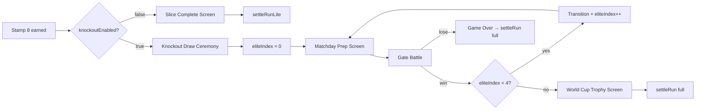
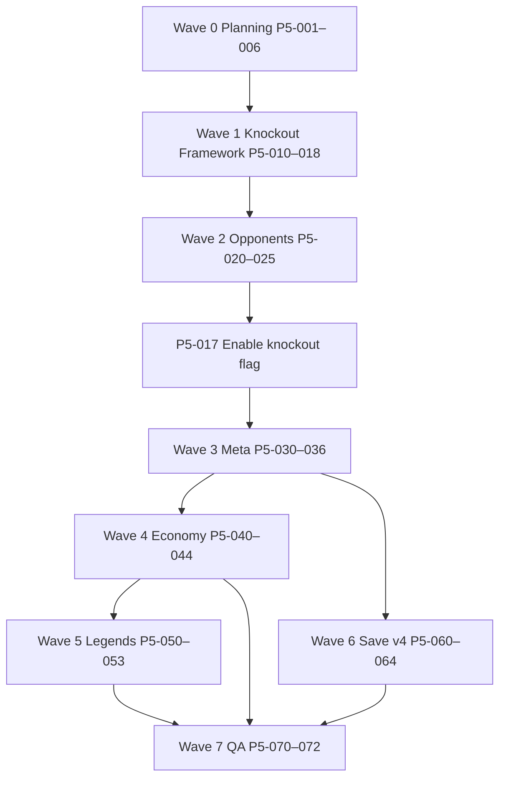

# SPEC 015 — Phase 5: Knockout Stage, Meta Progression, and Production Gameplay

**Status:** Planning complete — implementation not started  
**Authority:** Follows RC sign-off in [032 — Release Candidate Validation Report](./032-release-candidate-validation-report.md)  
**Inputs:** [005](./005-football-mvp-definition.md), [006B](./006B-technical-blueprint-revised.md), [007](./007-football-data-pack.md), [008](./008-meta-progression.md), [009](./009-gameplay-loop-node-system.md), [030](./030-release-candidate-bridge-retirement-plan.md)  
**Version:** v0.1  
**Date:** 2026-06-11  
**Execution model:** One atomic task per commit. Game playable after every commit.  
**Companion:** [034 — Phase 5 Task Breakdown](./034-phase-5-task-breakdown.md) · [035 — Assumptions & Tradeoffs](./035-phase-5-assumptions-tradeoffs.html) · [036 — Manual QA](./036-phase-5-manual-qa.md)

---

## 1. Executive Summary

Phase 4 (SPEC 014) completed the **football-native Release Candidate**: 8 Host City Challenges, local asset pipeline, identity cleanup, and locked release invariants. The campaign currently ends at stamp 8 with **Slice Complete → Settlement Lite** — knockout, meta economy, legends, and full settlement remain deferred.

Phase 5 builds the **definitive game loop**:

1. Marquee Signing → 8 Host City Challenges → 8 City Stamps  
2. **Knockout Draw Ceremony** → 5 historical gate battles (R16 → QF → SF → Final → Trophy lift)  
3. **World Cup Trophy** on Gate 4 win  
4. **Full run settlement** with Football Credits, fragments, achievements, and permanent account progress  
5. **Trophy room**, run history, and legends chase for long-term retention  

**Default recommendation:** Enable `FEATURES.knockoutEnabled` only in a **single explicit gate commit** (P5-017) after knockout content, routing, persistence, and validation harnesses pass with the flag still `false`. Do not flip the flag in the same commit as roster authoring or UI polish.

**Phase 5 verdict target:** **GO** for production gameplay when validation is green, manual QA passes, and save compatibility is proven.

---

## 2. Gameplay Vision

### 2.1 Player journey

```text
Title → Marquee Signing → Maps 0–7 (scout/contract/battle/stamp)
  → [8 stamps] Knockout Draw Ceremony
  → Matchday Squad Selection × 5 gates
  → Highlight duels vs historical XIs
  → World Cup Trophy ceremony (Gate 4 win)
  → Full Settlement (credits, album, fragments, achievements)
  → Trophy Room / Album / New Campaign
```

### 2.2 Knockout fantasy

After earning all eight City Stamps, the player enters a **seeded historical bracket** — not another map DAG. Each gate is a famous World Cup XI with telegraphed primary style, signature player, and recommended counter from Core Six. Difficulty escalates per [007 §8](./007-football-data-pack.md) and [009 §10](./009-gameplay-loop-node-system.md):

| Gate | Round | Team | Signature | Target win rate (1st run) |
|------|-------|------|-----------|---------------------------|
| 0 | Round of 16 | Uruguay 1950 | Ghiggia (41) | ~70% |
| 1 | Quarter-final | Brazil 1970 | Pelé (42) | ~55% |
| 2 | Semi-final | Argentina 1986 | Maradona (43) | ~40% |
| 3 | Final | France 1998 | Zidane (44) | ~30% |
| 4 | Trophy lift | Argentina 2022 | Messi (2) | ~20% (15–25% campaign win) |

No scouting nodes during knockout. Squad cap remains **6**. Consumables and squad order matter between gates.

### 2.3 Meta fantasy

Every run advances **something permanent** even on loss ([008 P1](./008-meta-progression.md)):

- Album signs and seen marks  
- Football Credits from new signs, duplicates, depth, and outcome bands  
- Legend fragments toward Icon/Legend unlocks  
- Achievements and trophy room flags (`reachedKnockout`, `reachedFinal`, `wonWorldCup`)  
- Run history entries for post-run review  

---

## 3. Non-Goals

- **No cloud save activation** at Phase 5 start — schema must remain v3-ready for future sync ([008 §17](./008-meta-progression.md)).  
- **No live API runtime** (TheSportsDB, PokeAPI) on public paths.  
- **No battle math / STYLE_CHART changes** unless an explicitly scoped combat task is approved.  
- **No breaking 8-city campaign** — maps 0–7 behavior unchanged when `knockoutEnabled: false`.  
- **No mass bridge deletion** — `speciesId`, `poke_*`, `catch-screen` retire only via save v4 + audited tasks ([030](./030-release-candidate-bridge-retirement-plan.md)).  
- **No React/Next migration** — runtime stays vanilla JS + domain modules.  
- **No combined mega-commits** mixing knockout enable, economy, save migration, and content.  
- **No T2 likeness portraits** without legal sign-off (T1 jersey SVGs remain default).  
- **No full 50-player catalog requirement** — knockout rosters may use catalog stand-ins per 007 §8 implementation notes.

---

## 4. Current Baseline (post–Phase 4 RC)

| Area | State | Evidence |
|------|-------|----------|
| Playable campaign | Maps 0–7, 8 stamps → Slice Complete → Settlement Lite | `getFootballSliceStampTarget()` = 8 |
| Feature flags | `maxMapIndex: 7`, `knockoutEnabled: false`, `cloudSave: false` | `js/domain/features.js` |
| Knockout routing stub | Stamp 8 → `showSliceCompleteScreen()`; gated `startMap(8)` exists but **wrong for football** | `game.js` `showBadgeScreen` advance |
| Elite infrastructure | `eliteIndex`, `showElitePrepScreen`, `doGen2Elite4` — Pokemon/Gen2 paths | `game.js` |
| Knockout data | **Not authored** — no `knockout_teams.json` on disk | `data/football/` |
| Knockout album page | Stub in `album_layout_expansion.json`, `hiddenUntil: knockout_enable` | Not merged to runtime |
| Meta settlement | `DomainSave.settleRunLite` — album signs only; `metaRewardsLabel: "Meta rewards coming soon"` | `js/domain/save.js` |
| Meta module | **Not implemented** — `domain/meta.js` specified in 008, absent | — |
| Player catalog | 33 profiles in `player_profiles.json` | Missing knockout-only IDs 37–41 per 007 |
| Save schema | v3 — `game_album`, `football_last_settled_run_id` | `DOMAIN_SAVE_SCHEMA_VERSION = 3` |
| Validation | Domain + P1/P2/P3 + identity + assets + docs | `npm run validate` |
| Manual QA | RC runbook — knockout blocked | [031](./031-release-candidate-manual-qa-runbook.md) |

**RC verdict:** External demo **GO** · Phase 5 implementation **ALLOWED** · Knockout **OFF**.

---

## 5. Knockout Architecture

### 5.1 Design principle: linear gates, not map 8

Football knockout is **not** `startMap(8)` + `generateMap()`. Legacy map index 8 is the Pokemon Elite Four DAG. Phase 5 introduces a **football-only linear gate runner** that reuses battle + prep UI without map graph navigation.



### 5.2 Module boundaries

| Module | Responsibility |
|--------|----------------|
| `data/football/knockout_teams.json` | 5 gates — roster, styles, kit, form bands, copy |
| `js/domain/knockout.js` | Load, validate, `getGate(index)`, `buildGateTeam(gate)` |
| `js/game.js` | `enterKnockoutStage()`, `doKnockoutGate()`, ceremony routing |
| `js/ui.js` | Football-native prep screen, draw ceremony, trophy screen |
| `js/domain/bosses.js` | Unchanged for host cities; no knockout team building here |

### 5.3 State model (run scope)

Extend run snapshot (save v3 compatible — no schema bump required for run fields):

```javascript
{
  knockoutPhase: boolean,      // true while in gate chain
  eliteIndex: number,          // 0–4, existing field
  knockoutGatesCleared: number // settlement input
}
```

Persist `eliteIndex` and `knockoutPhase` in `poke_current_run` JSON (existing key; bridge per 030).

### 5.4 Routing rules

1. When `badges === 8` and `knockoutEnabled === false`: **unchanged** — `showSliceCompleteScreen()` → `settleRunLite`.  
2. When `badges === 8` and `knockoutEnabled === true`: **block** slice complete; run `enterKnockoutStage()`.  
3. Never call `startMap(8)` in football mode.  
4. Reload mid-knockout: resume at `eliteIndex` prep or battle per Gen2 elite pattern.

### 5.5 Enable gate

`FEATURES.knockoutEnabled = true` only in commit **P5-017** after:

- `knockout_teams.json` validates offline  
- `validate-phase5-qa.mjs` passes with opt-in `expectKnockoutEnabled: true` in that commit only  
- Manual smoke: stamp 8 → ceremony → gate 0 prep visible

---

## 6. Meta Progression Architecture

### 6.1 Layering (from 008)

| Layer | Keys / module | Phase 5 target |
|-------|---------------|----------------|
| Current run | `poke_current_run` | Add knockout fields, richer `ledger` |
| Permanent account | `game_album`, new meta keys | Credits, fragments, flags, history |
| Settlement | `domain/meta.js` → `settleRun()` | Replace `settleRunLite` for football ends |
| Cloud (deferred) | `cloud-save.js` SYNC_KEYS | Document only; do not enable |

### 6.2 New domain module: `domain/meta.js`

Pure functions per [008 §18](./008-meta-progression.md):

- `settleRun(runSnapshot, accountState, config) → { patch, summary }`  
- `computeOutcomeBand(snapshot)`  
- `evaluateAchievements(snapshot, account)`  
- `applyLegendFragmentGrants(ledger, account)`  

`game.js` calls meta → `DomainSave.applyAccountPatch(patch)` → UI renders `summary`.

### 6.3 Account fields (v3-compatible flat keys)

Introduce incrementally before optional v4 blob:

| Key | Type | Purpose |
|-----|------|---------|
| `footballCredits` | number | Spendable meta currency |
| `legendFragments` | `{ [legendId]: number }` | Chase toward unlock |
| `unlockedLegends` | `number[]` | Icon/Legend roster unlocks |
| `game_album_meta` | object | Page unlocks, milestones |
| `accountFlags` | object | `reachedKnockout`, `reachedFinal`, `wonWorldCup` |
| `runCount` | number | Lifetime runs |
| `campaignWins` | number | World Cup wins |
| `runHistory` | array (cap 50) | Compact run summaries |
| `poke_achievements` | set union | Existing achievement IDs |

### 6.4 Trophy room

Lightweight title-screen panel (not a new mode):

- World Cup wins count  
- Best gate reached  
- Album completion %  
- Recent run history (3 entries)  

### 6.5 Album pages

Merge from `album_layout_expansion.json`:

- **knockout** page — unlock when `knockoutPhase` entered or first gate seen  
- **legends** page — unlock when first fragment earned or legend signed  

---

## 7. Save Implications

### 7.1 Phase 5 default: extend v3

Meta keys can ship as **additional localStorage keys** without bumping `saveVersion`, matching how `game_album` migrated in v3. `DomainSave.validateAccountModel` extends to new fields.

### 7.2 Save v4 evaluation (Wave 6)

Trigger v4 only if:

- Account blob exceeds maintainability threshold (10+ keys)  
- Bridge retirement requires unified account object  
- Cloud sync prep needs single envelope  

**v4 must include:**

- Explicit `migrateSaveV3toV4()` with report object  
- Backwards read of v3 keys for one release cycle  
- Rollback path (keep v3 reader)  
- `scripts/validate-save-migration.mjs`  
- No silent data loss on `poke_dex`, `speciesId` in active runs  

### 7.3 Settlement dedupe

Retain `football_last_settled_run_id` guard. Full settlement must use same dedupe semantics as lite.

---

## 8. UI Implications

| Surface | Phase 5 change |
|---------|----------------|
| Badge screen advance | Branch: knockout ceremony vs next map vs slice complete |
| `transition-screen` | Knockout Draw Ceremony copy + skippable 3s |
| `elite-prep-screen` | Football portraits, styles, gate name, counter hint |
| Battle HUD | Gate round labels (R16, QF, SF, Final, Trophy lift) |
| Win screen | World Cup Trophy ceremony (new or reskin `win-screen`) |
| Game over | Full settlement with credits breakdown |
| Settlement modal | Credits, fragments, achievements, milestones |
| Title screen | Trophy room entry |
| Album modal | Knockout + legends pages visible when unlocked |

All copy via `GAME_THEME` / data JSON — no hardcoded Pokemon strings on football paths.

---

## 9. Asset Implications

| Asset | Action | Priority |
|-------|--------|----------|
| Knockout gate kit chips | CSS variables from JSON `kitColors` | P5-012 |
| Trophy / World Cup icon | `ui_asset_manifest.json` + SVG | P5-025 |
| Knockout ceremony backdrop | Optional T1 SVG; CSS gradient fallback | P5-012 |
| Historical team badges | Text + kit colors first; emblem SVG defer Phase 6 | Defer |
| Legend portraits | Existing T1 for IDs 42, 43, 46, 47, 50 | P5-050 |

No new likeness tier without legal review.

---

## 10. Validation Strategy

### 10.1 Per-task

```bash
rtk npm run validate
```

Add `rtk npm run smoke:http` when touching runtime, UI, or static assets.

### 10.2 New harnesses

| Script | Purpose |
|--------|---------|
| `validate-phase5-qa.mjs` | Phase 5 invariants, knockout guards, meta module presence |
| `validate-knockout-data.mjs` | `knockout_teams.json` schema + catalog ID resolution |
| `validate-save-migration.mjs` | v4 migration fixtures (Wave 6) |

Wire into `package.json` `validate` after P5-006.

### 10.3 Regression

- With `knockoutEnabled: false`, all Phase 3/RC harnesses remain green  
- Identity cleanup harness still enforces flag default false until P5-017  

---

## 11. Manual QA Strategy

See [036 — Phase 5 Manual QA Runbook](./036-phase-5-manual-qa.md).

**Minimum paths before GO:**

1. Fresh account — 8-city run with knockout off (regression)  
2. Fresh account — full campaign win with knockout on  
3. Knockout entry at stamp 8  
4. Loss at each gate tier (QF, SF, Final) — settlement + meta  
5. Reload during knockout prep and battle  
6. Trophy ceremony → settlement → title → trophy room  
7. Album knockout page unlock  
8. Second run — credits and history persist  

---

## 12. Risks

| Risk | Severity | Mitigation |
|------|----------|------------|
| `startMap(8)` used for football knockout | **High** | Linear gate runner; lint in validate-phase5-qa |
| Slice complete fires when knockout intended | **High** | Explicit branch in `showBadgeScreen` advance |
| Missing profile IDs 37–41 break gate teams | **High** | Author before enable gate; offline validation |
| Economy inflation on migration | Medium | No retroactive credit grants ([008 §17.1](./008-meta-progression.md)) |
| Save v4 breaks existing players | **High** | Defer v4; v3 flat keys first; migration harness |
| Elite prep still shows PokeAPI sprites | Medium | P5-015 football-native prep reskin |
| First-run win rate out of band | Medium | Tune form levels in JSON only |
| Scope creep into cloud/React | Medium | Cut line §14 enforced per task |

---

## 13. Dependency Graph



**Critical path:** Planning → knockout data + runner → enable gate → full settlement → QA sign-off.

---

## 14. Cut Line

Ship Phase 5 **GO** with:

- ✅ 8-city campaign (unchanged regression)  
- ✅ 5-gate knockout + trophy win path  
- ✅ Full settlement with credits + album  
- ✅ Account flags + run history + trophy room (minimal)  
- ✅ Knockout album page  
- ✅ Legend fragments storage + one unlock path  
- ✅ Validation green + manual QA PASS  

**Defer to Phase 6 if schedule pressure:**

- Save v4 unified blob (stay on v3 flat keys)  
- Legend map nodes on campaign maps  
- Shop / spend credits UI  
- Seeded bracket variation across runs  
- T2 trophy emblems and likeness portraits  
- Cloud save re-enable  
- Classic mode bundle split  
- Full 50-player catalog completion  

---

## 15. Deferred Phase 6 Items

1. **Meta shop** — spend Football Credits on cosmetics (`unlockedCosmetics` fills)  
2. **Dynamic bracket seeding** — gate order variants, regional paths  
3. **Continental Cup mode** (`FEATURES.continentalCup`)  
4. **Cloud save + cross-device merge** QA  
5. **Save v4** if not completed in Phase 5 Wave 6  
6. **Bridge retirement batch** — `speciesId` → `profileId` in run payloads  
7. **Nuzlocke / trade / endless** football variants  
8. **Live API portrait pipeline** (TheSportsDB) behind explicit opt-in  
9. **Balance telemetry** — playtest win-rate automation  
10. **Localization** — ES/PT copy packs  

---

## 16. Execution Waves Summary

| Wave | Goal | Exit signal |
|------|------|-------------|
| 0 | Planning + harness | Docs 033–037, validate-phase5-qa wired |
| 1 | Knockout framework | Gate runner, ceremony, persistence; flag still false |
| 2 | Opponents + trophy | `knockout_teams.json` complete, trophy screen |
| 3 | Meta progression | `domain/meta.js`, trophy room, history, achievements |
| 4 | Economy | Credits earn/spend storage, full settlement UI |
| 5 | Legends | Fragments, unlock flow, legends album page |
| 6 | Save v4 | Only if v3 flat keys insufficient — migration harness green |
| 7 | QA + release | 037 report GO, manual QA PASS |

---

## 17. Commit Discipline

```text
<Phase 5 task summary>

Implementation:
<what changed and why it completes the task>

Validation:
rtk npm run validate
(+ smoke:http if applicable)

Test:
<evidence>

Docs:
<updated docs>
```

Always read [034](./034-phase-5-task-breakdown.md) before picking the next task.

---

*End of SPEC 015 Phase 5 Plan.*
